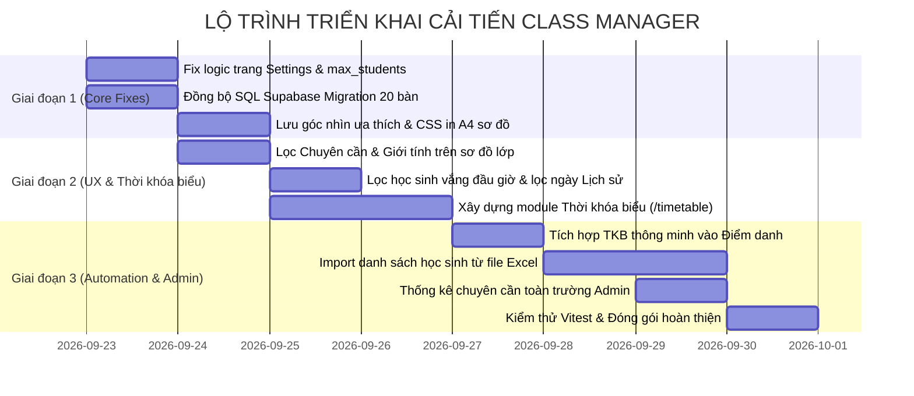

# Class Manager — Kế Hoạch Cải Tiến & Nâng Cấp Hệ Thống (Improvement Plan)

> **Mục tiêu:** Nâng cấp, hoàn thiện và mở rộng hệ thống Class Manager hiện tại từ nền tảng đã chạy tốt lên chuẩn sản phẩm thực tế cho Trường THCS Nguyễn Tất Thành.  
> **Quy chuẩn chốt:** 20 bàn / 40 học sinh / 4 dãy × 5 hàng / 2 góc nhìn / Đa lớp & Phân quyền RBAC.  
> **Thời gian áp dụng:** Kế hoạch thực hiện tiếp theo (Bắt đầu từ 23/09/2026).  

---

## I. HIỆN TRẠNG & ĐÁNH GIÁ ĐẦU VÀO

Hệ thống hiện tại đã hoàn thiện bộ khung chức năng cốt lõi (Core MVP & Prototype):
* **Đã chạy tốt:** 16 lớp THCS (6A1–9A4), 24 giáo viên, 10 môn học, 480 học sinh.
* **Đã chuẩn hóa:** Sơ đồ lớp 20 bàn / 40 chỗ ngồi, 2 góc nhìn không gian, thuật toán Fisher-Yates, phân quyền RBAC (Admin, GVCN, GVBM), điểm danh buổi & theo môn, xuất Excel, trang Login chuẩn bảo mật trường học.
* **Mục tiêu của Kế hoạch Cải tiến này:** Tập trung giải quyết các điểm chưa đồng bộ, nâng cao trải nghiệm thực tế cho giáo viên trong giờ dạy, tích hợp **Thời khóa biểu thông minh**, bổ sung các công cụ tự động hóa (Import Excel, in ấn A4, bộ lọc sơ đồ) và chuẩn hóa CSDL Supabase để sẵn sàng triển khai chính thức.

---

## II. DANH MỤC CÁC HẠNG MỤC CẢI TIẾN TRỌNG TÂM

```
┌────────────────────────────────────────────────────────────────────────────────────────┐
│                          HỆ THỐNG CẢI TIẾN CLASS MANAGER                               │
├───────────────────┬───────────────────┬──────────────────┬───────────────┬─────────────┤
│ 1. SƠ ĐỒ LỚP HỌC  │ 2. CÀI ĐẶT & DATA │ 3. ĐIỂM DANH &   │ 4. THỜI KHÓA  │ 5. ADMIN &  │
│    (SEATING MAP)  │    (CONSISTENCY)  │    HỌC SINH      │    BIỂU (TKB) │    HỆ THỐNG │
├───────────────────┼───────────────────┼──────────────────┼───────────────┼─────────────┤
│ • Lọc Chuyên cần  │ • Fix Settings    │ • Import Excel   │ • Lưới TKB    │ • Thống kê  │
│ • Lọc Giới tính   │ • Lưu max_students│ • Lọc vắng mặt   │   Thứ 2 - 7   │   toàn trường│
│ • In A4 chuẩn     │ • Đồng bộ Schema  │ • Lọc khoảng     │ • Tự động gắn │ • Báo cáo   │
│ • Lưu góc nhìn    │   Supabase 20 bàn │   ngày lịch sử   │   môn điểm danh│  tổng hợp  │
│   ưu thích        │ • Tối ưu Storage  │ • Thẻ liên hệ PH │ • In TKB dán  │ • Phân công │
│                   │                   │                  │   bảng tin    │   GV bộ môn │
└───────────────────┴───────────────────┴──────────────────┴───────────────┴─────────────┘
```

---

## 1. CẢI TIẾN 1 — SƠ ĐỒ LỚP HỌC (SEATING MAP ENHANCEMENTS)

### 1.1. Lọc trực quan Chuyên cần hôm nay trên sơ đồ lớp
* **Vấn đề:** Giáo viên khi đứng lớp nhìn vào sơ đồ chỉ thấy tên học sinh mà không biết ngay em nào hôm nay đang vắng mặt hoặc đi muộn.
* **Giải pháp cải tiến:**
  * Thêm nút bật/tắt: `[👁 Hiện trạng thái điểm danh hôm nay]`.
  * Nếu học sinh hôm nay **Vắng mặt**: Hiển thị viền đỏ và chấm trạng thái `Vắng` nổi bật trên ghế ngồi.
  * Nếu học sinh **Đi muộn**: Hiển thị viền vàng hổ phách và nhãn `Muộn`.
  * Giúp giáo viên đứng trên bục giảng chỉ cần liếc sơ đồ là kiểm soát được chỗ trống thực tế trong phòng học.

### 1.2. Lọc trực quan Giới tính (Nam / Nữ)
* **Giải pháp cải tiến:**
  * Thêm bộ lọc: `Tất cả` | `Nam` | `Nữ`.
  * Highlight nhẹ nhàng theo giới tính (Xanh dương nhạt cho Nam, Hồng phấn nhạt cho Nữ) giúp giáo viên dễ dàng cân bằng tỷ lệ nam/nữ khi sắp xếp chỗ ngồi giữa các dãy.

### 1.3. Chuẩn hóa tính năng In sơ đồ lớp học ra khổ giấy A4 (Print Optimization)
* **Vấn đề:** Khi bấm nút "In sơ đồ", trình duyệt in kèm cả sidebar, thanh điều hướng và có thể bị co cụm vỡ trang.
* **Giải pháp cải tiến:**
  * Bổ sung CSS `@media print` chuyên biệt:
    * Ẩn toàn bộ Sidebar, Header, thanh công cụ, nút bấm.
    * Tự động ép xoay trang ngang (`@page { size: landscape; margin: 10mm; }`).
    * Căn giữa bảng lớp, bàn giáo viên, 4 dãy bàn 20 ghế rõ nét chữ in đen trắng tương phản cao, chân trang có phần ký tên GVCN.

### 1.4. Tự động ghi nhớ Góc nhìn ưa thích (Perspective Persistence)
* **Giải pháp:** Lưu trạng thái `nhin_tu_duoi_len` hoặc `nhin_tu_buc_giang` vào `localStorage` theo từng tài khoản giáo viên, không bị reset về mặc định sau mỗi lần F5.

---

## 2. CẢI TIẾN 2 — CÀI ĐẶT LỚP HỌC & TÍNH NHẤT QUÁN DỮ LIỆU

### 2.1. Chuẩn hóa trang Cài đặt lớp (`src/app/(dashboard)/settings/page.tsx`)
* **Các việc cần xử lý:**
  1. Thay đổi state khởi tạo mặc định:
     * `maxStudents = '40'` (thay vì `'45'`).
     * `deskCount = '20'` (thay vì `'25'`).
  2. Cập nhật `classSettingsSchema` trong `src/lib/validations/forms.ts`:
     * Nhận thêm trường `max_students: z.coerce.number().min(1).max(40)`.
  3. Cập nhật `ClassService.updateClassSettings` và `LocalStore.updateClass`:
     * Lưu giá trị `max_students` thật vào kho dữ liệu khi giáo viên bấm "Lưu thay đổi".
  4. Hiển thị khối thông số trực quan:
     * Sĩ số hiện tại: `... / 40 học sinh`.
     * Số chỗ còn trống: `... ghế`.
     * Tỷ lệ lấp đầy phòng học: `...%`.

### 2.2. Đồng bộ lược đồ CSDL Supabase Migration (`supabase/migrations/001_initial_schema.sql`)
* **Các việc cần xử lý:**
  * Cập nhật ràng buộc bảng `classes`: `max_students <= 40`, `desk_count = 20`.
  * Cập nhật bảng `desks`: `desk_number BETWEEN 1 AND 20`, `row_num BETWEEN 1 AND 5`, `col_num BETWEEN 1 AND 4`.
  * Bổ sung đầy đủ DDL cho các bảng quan hệ:
    * `subjects` (id, code, name)
    * `class_memberships` (id, teacher_id, class_id, role)
    * `subject_assignments` (id, teacher_id, class_id, subject_id)
    * `timetable_entries` (id, class_id, day_of_week, period, subject_id, teacher_id)
  * Thiết lập các chính sách bảo mật hàng (Row Level Security - RLS) cho từng bảng theo đúng vai trò Admin / GVCN / GVBM.

---

## 3. CẢI TIẾN 3 — ĐIỂM DANH & QUẢN LÝ HỌC SINH

### 3.1. Tính năng Nhập học sinh hàng loạt từ file Excel (Import Students via Excel/CSV)
* **Vấn đề:** Đầu năm học, GVCN phải nhập từng học sinh một rất mất thời gian.
* **Giải pháp cải tiến:**
  * Thêm nút `[📥 Nhập từ Excel]` trên trang danh sách học sinh.
  * Hỗ trợ tải file mẫu `mau_danh_sach_hoc_sinh.xlsx` (Cột: STT, Họ và tên, Mã HS, Giới tính, Ngày sinh, SĐT phụ huynh).
  * Modal xem trước (Preview) dữ liệu trước khi lưu:
    * Tự động kiểm tra trùng mã học sinh.
    * Tự động kiểm tra nếu tổng số vượt quá 40 em (báo lỗi không cho nhập).
    * Xác nhận và nạp nhanh toàn bộ vào lớp.

### 3.2. Cải tiến trải nghiệm Điểm danh nhanh (Attendance Quick Actions)
* **Giải pháp:**
  * Lọc danh sách điểm danh: Hỗ trợ tab xem nhanh danh sách những em "Chưa có mặt" (Vắng hoặc Muộn) để GVCN dễ gửi báo cáo đầu giờ cho Ban Giám hiệu.

### 3.3. Bộ lọc thời gian nâng cao trong Lịch sử chuyên cần (`/history`)
* **Giải pháp:**
  * Bổ sung bộ chọn khoảng ngày: `Tuần này` | `Tháng này` | `Tất cả` | `Tùy chọn khoảng ngày`.
  * Tính toán tỷ lệ chuyên cần theo đúng khoảng ngày đang được lọc thay vì chỉ tính toàn bộ niên khóa.

### 3.4. Thẻ liên lạc phụ huynh trên trang Chi tiết học sinh (`/students/[id]`)
* **Giải pháp:**
  * Bổ sung nút gọi nhanh (`tel:`) và gửi tin nhắn Zalo/SMS mẫu thông báo tình hình học tập và chuyên cần của học sinh cho phụ huynh chỉ với 1 chạm.

---

## 4. CẢI TIẾN 4 — THỜI KHÓA BIỂU LỚP HỌC (CLASS TIMETABLE MODULE)

Đây là **mảnh ghép liên kết thực tế** giữa thời gian học, môn học, giáo viên phụ trách và luồng điểm danh hằng ngày.

### 4.1. Bảng lưới Thời khóa biểu tương tác (`/timetable`)
* **Cấu trúc chuẩn:** 6 ngày học (Thứ Hai $\rightarrow$ Thứ Bảy) × 5 tiết buổi sáng (Tiết 1 $\rightarrow$ Tiết 5).
* **Nội dung mỗi ô tiết học:**
  * Tên môn học kèm màu sắc đặc trưng (Toán - Xanh dương, Ngữ văn - Xanh lá, Tiếng Anh - Tím, KHTN - Vàng hổ phách...).
  * Tên giáo viên bộ môn phụ trách (tự động lấy từ phân công giảng dạy `subject_assignments`).
* **Thao tác nhanh:**
  * GVCN hoặc Admin bấm vào ô để chọn nhanh môn học cho tiết đó.
  * Hỗ trợ nút **[Xếp nhanh theo tuần]** hoặc **[Sao chép TKB]** sang tuần mới.

### 4.2. Điểm danh thông minh theo thời gian thực (Smart Contextual Attendance)
* Khi giáo viên vào trang Điểm danh (`/attendance`), hệ thống tự động đối chiếu thứ trong tuần và giờ hiện tại:
  * Ví dụ: *Thứ Ba lúc 08:30* $\rightarrow$ Hệ thống tự nhận diện đang là **Tiết 2: Môn Toán (Thầy Nguyễn Văn An)**.
  * Tự động chọn sẵn môn học và giáo viên phụ trách mà không cần chọn thủ công từ dropdown.

### 4.3. Widget "Lịch học hôm nay" trên Dashboard
* Hiển thị ngay trên Dashboard của lớp:
  * Thanh tiến trình các tiết học trong ngày (Đã học xong, Đang học, Tiết tiếp theo).
  * Tiết học hiện tại nổi bật giúp giáo viên và học sinh nắm bắt nhịp độ buổi học.

### 4.4. Bản in Thời khóa biểu A4 dán bảng tin lớp (Printable Timetable)
* Hỗ trợ nút **[In Thời khóa biểu]**:
  * Tự động căn chỉnh vừa vặn trên 1 trang giấy A4 ngang.
  * Hiển thị rõ ràng tiêu đề: *Trường THCS Nguyễn Tất Thành · Thời khóa biểu Lớp 9A1 · Niên khóa 2026 - 2027*.
  * Có phần phê duyệt của Ban Giám hiệu và chữ ký GVCN.

---

## 5. CẢI TIẾN 5 — ADMIN PORTAL & BÁO CÁO TOÀN TRƯỜNG

### 5.1. Bảng điều khiển Quản trị viên (Admin Executive Dashboard)
* **Bổ sung chỉ số toàn trường:**
  * Tỷ lệ học sinh đi học toàn trường hôm nay (ví dụ: `468/480 học sinh · 97.5%`).
  * Danh sách các lớp có tỷ lệ vắng cao trong ngày để Ban Giám hiệu nắm tình hình.
  * Biểu đồ phân bổ học sinh theo từng khối lớp (Khối 6, 7, 8, 9).

### 5.2. Báo cáo tổng hợp xuất file Excel cho Nhà trường
* **Giải pháp:**
  * Nút `[Xuất báo cáo trường]` tại Admin Portal: Tạo file Excel đa trang gồm:
    * Sheet 1: Danh sách tổng hợp 16 lớp (GVCN, Sĩ số, Phòng học, Số bàn).
    * Sheet 2: Danh sách 24 giáo viên và bảng phân công chuyên môn.
    * Sheet 3: Bảng theo dõi chuyên cần toàn trường theo tháng.
    * Sheet 4: Tổng hợp Thời khóa biểu toàn trường.

---

## III. KẾ HOẠCH TRIỂN KHAI THEO GIAI ĐOẠN (SPRINT ROADMAP)



### 📋 GIAI ĐOẠN 1: Chuẩn hóa Dữ liệu & Tính năng Thiết yếu (Ưu tiên làm ngay)
- [x] **Task 1.1:** Cập nhật `src/app/(dashboard)/settings/page.tsx`, `src/services/class.service.ts` và schema form để lưu và cập nhật chuẩn `max_students = 40` và `desk_count = 20`.
- [x] **Task 1.2:** Cập nhật file `supabase/migrations/001_initial_schema.sql` bổ sung các bảng quan hệ mới (`subjects`, `class_memberships`, `subject_assignments`, `timetable_entries`) và ràng buộc 20 bàn.
- [x] **Task 1.3:** Tối ưu CSS Print `@media print` cho trang Sơ đồ lớp (`/seating`) để in A4 ngang chuẩn không viền thừa.
- [x] **Task 1.4:** Lưu `viewPerspective` vào `localStorage`.

### 📋 GIAI ĐOẠN 2: Nâng tầm Trải nghiệm Giảng dạy & Thời khóa biểu
- [x] **Task 2.1:** Thêm layer hiển thị trạng thái điểm danh hôm nay trực tiếp trên ghế ngồi của sơ đồ lớp.
- [x] **Task 2.2:** Thêm bộ lọc Giới tính (Nam/Nữ) highlight trên sơ đồ lớp.
- [ ] **Task 2.3:** Bổ sung tab lọc nhanh học sinh vắng / muộn đầu giờ trong màn hình Điểm danh.
- [ ] **Task 2.4:** Thêm bộ lọc khoảng ngày (Tuần / Tháng) trên trang Lịch sử chuyên cần.
- [ ] **Task 2.5:** Xây dựng trang **Thời khóa biểu lớp học (`/timetable`)** dạng lưới tương tác (Thứ 2 $\rightarrow$ Thứ 7, Tiết 1 $\rightarrow$ Tiết 5), chọn môn và gán giáo viên phụ trách.
- [ ] **Task 2.6:** Tối ưu in Thời khóa biểu A4 ngang dán bảng tin lớp học.

### 📋 GIAI ĐOẠN 3: Tự động hóa & Báo cáo Quản trị
- [ ] **Task 3.1:** Kết nối Thời khóa biểu thông minh vào trang Điểm danh (tự nhận diện môn và giáo viên theo giờ học hiện tại).
- [ ] **Task 3.2:** Bổ sung widget "Lịch học hôm nay" trên Dashboard lớp học.
- [ ] **Task 3.3:** Xây dựng tính năng Import danh sách học sinh từ file Excel `.xlsx` có modal xem trước và validate dữ liệu.
- [ ] **Task 3.4:** Bổ sung widget thống kê chuyên cần toàn trường trên Admin Dashboard.
- [ ] **Task 3.5:** Viết thêm các test cases Vitest kiểm thử giới hạn 40 học sinh, Thời khóa biểu và luồng import.

---

## IV. TIÊU CHÍ NGHIỆM THU (ACCEPTANCE CRITERIA)

Mỗi tính năng cải tiến được coi là hoàn thành khi đạt đủ các tiêu chuẩn sau:

1. **Hiển thị & Thẩm mỹ:**
   * Đúng phong cách giáo dục thanh lịch: nền sáng (`bg-surface`), border tinh tế, font chữ chuẩn tiếng Việt không lỗi dấu, không dùng hiệu ứng gradient/neon lòe loẹt.
2. **Quy chuẩn Lớp học:**
   * Luôn đảm bảo bất biến: 20 bàn, 40 ghế, 4 dãy × 5 hàng, tối đa 40 học sinh/lớp.
3. **Thời khóa biểu & Phân công:**
   * Mỗi tiết trong ngày tại 1 lớp chỉ gán tối đa 1 môn học và 1 giáo viên; dữ liệu đồng bộ với phân công giảng dạy.
4. **Hiệu năng & Khả năng truy cập:**
   * Tải trang dưới 300ms, chuyển lớp tức thì, hỗ trợ đầy đủ phím tắt và nhãn trợ năng (ARIA).
5. **Kiểm thử tự động:**
   * Toàn bộ test suite Vitest chạy thành công 100% (`npm test`).
   * Không có lỗi TypeScript (`npx tsc --noEmit`).
