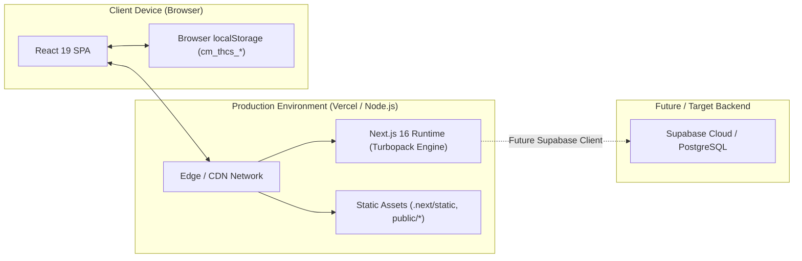

# Deployment Architecture

## 1. Hosting & Runtime Model

The application is structured as a **Next.js 16 (App Router)** deployment running on Node.js or edge runtime environments (e.g., Vercel, AWS Amplify, Docker container).



---

## 2. Build Pipeline & Production Artifacts

### 2.1. Compilation via Turbopack
The production build is executed with:
```bash
npm run build
```
Under the hood, Next.js 16 uses Turbopack to compile the 18 application routes, generating static HTML/JS bundles.

### 2.2. Route Inventory at Build Time
All routes compile as dynamic or client-rendered pages (`○ Static` / `ƒ Dynamic`):

| Route Path | Type | Description |
| :--- | :---: | :--- |
| `/` | Client Redirect | Checks auth status and redirects to `/login`, `/dashboard`, or `/admin/dashboard` |
| `/login` | Client Page | 1-Click test accounts and authentication form |
| `/access-denied` | Client Page | 403 Forbidden roadblock view |
| `/dashboard` | Client Page | Classroom executive overview and today's schedule |
| `/students` | Client Page | Student roster, filtering, Excel import/export |
| `/students/[id]` | Dynamic Page | Detailed student profile, attendance record, parent contact cards |
| `/seating` | Client Page | 20-desk classroom layout, dual perspective, live attendance overlay |
| `/attendance` | Client Page | Smart period attendance, quick filters, admin copy action |
| `/history` | Client Page | Date-range attendance matrix, period KPIs |
| `/timetable` | Client Page | 2-shift weekly schedule, conflict prevention, print view |
| `/announcements` | Client Page | Class bulletin board |
| `/settings` | Client Page | Class metadata configuration, capacity controls |
| `/admin/dashboard`| Client Page | School-wide attendance overview, grade breakdown, report export |
| `/admin/classes` | Client Page | 16-class directory, room assignments, GVCN allocation |
| `/admin/teachers` | Client Page | Faculty directory, 2-grade limit checks, subject assignments |
| `/admin/settings` | Client Page | System settings & school metadata |

---

## 3. Environment Configuration

### 3.1. Current Environment Variables (`.env.local`)
The application currently runs in self-contained prototype mode. The `.env.local` file contains Supabase configuration placeholders:

```bash
NEXT_PUBLIC_SUPABASE_URL=https://your-project.supabase.co
NEXT_PUBLIC_SUPABASE_ANON_KEY=your_supabase_anon_key
```

### 3.2. Middleware Detection (`src/middleware.ts`)
The Edge Middleware checks whether valid Supabase credentials have been configured:
```typescript
const isSupabaseConfigured =
  supabaseUrl &&
  supabaseUrl.startsWith('http') &&
  supabaseKey &&
  supabaseKey !== 'your_supabase_anon_key';

if (!isSupabaseConfigured) {
  // If Supabase is not configured yet, allow navigating smoothly
  return supabaseResponse;
}
```
* **Current Behavior:** Because credentials are placeholder strings, the middleware bypasses Supabase session cookies and allows the client-side `AuthService` to manage sessions via `localStorage`.
* **Production Ready:** As soon as real Supabase credentials are provided, the middleware will automatically activate server-side session refreshes and cookie validations without requiring code changes.

---

## 4. Client-Side Runtime Assumptions

1. **Storage Availability:**
   - The browser must have `localStorage` enabled (default in modern browsers).
   - In private/incognito windows with storage disabled, memory fallback cache prevents hard crashes.
2. **Screen Resolutions & Viewports:**
   - **Desktop (>= 1024px):** Displays full two-column layouts, sidebars, and full 4-column seating charts.
   - **Tablet / Small Laptop (768px – 1023px):** Compact grid layouts with sticky table columns.
   - **Mobile (< 768px):** Collapsible off-canvas navigation drawer (`MobileNav`), day tab selectors for timetable, and horizontally scrollable tables.
3. **Printing Environment:**
   - Supports CSS `@media print` with paper size presets (`@page { size: landscape; margin: 8mm; }`) for A4 seating charts and weekly timetables.
