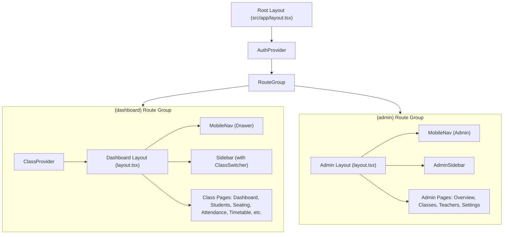

# Module Architecture

## 1. Directory & Package Structure

The codebase is organized under a modular TypeScript directory layout inside `/src`:

```text
src/
├── app/                  # Next.js 16 App Router pages and layout wrappers
│   ├── (admin)/admin/    # Administrative governance pages
│   ├── (auth)/login/     # User login & 1-click persona testing
│   ├── (dashboard)/      # Teacher & classroom operational pages
│   ├── access-denied/    # 403 Forbidden access barrier page
│   ├── globals.css       # Design tokens, OKLCH variables, print CSS
│   ├── layout.tsx        # Root HTML shell with Geist font injection
│   └── page.tsx          # Root redirector based on auth & role
│
├── components/           # Reusable UI & Shell Components
│   ├── shell/            # Navigational layout chrome (Sidebars, Topbar, Switcher)
│   └── ui/               # Design system primitives (Button, Modal, Input, Badge, etc.)
│
├── contexts/             # Client-side React State Contexts
│   ├── auth-context.tsx  # Session persistence and active user state
│   └── class-context.tsx # Active class selection and contextual role resolver
│
├── lib/                  # Foundational utilities, stores, constants
│   ├── auth.ts           # Authentication service & session helpers
│   ├── constants.ts      # Core business numbers, period schedules, subject colors
│   ├── export.ts         # Excel generation (xlsx) & template generator
│   ├── mock-data.ts      # Deterministic 16-class school seed dataset
│   ├── store.ts          # LocalStore repository DAO implementation
│   ├── utils.ts          # Tailwind cn helper, date formatting, array shuffler
│   ├── supabase/         # Supabase browser & server client factories
│   └── validations/      # Zod runtime schema definitions
│
├── services/             # Application Service Layer (Domain Logic + RBAC)
│   ├── admin-report.service.ts
│   ├── announcement.service.ts
│   ├── attendance.service.ts
│   ├── auth-guard.ts
│   ├── class.service.ts
│   ├── note.service.ts
│   ├── seating.service.ts
│   ├── student.service.ts
│   ├── teacher.service.ts
│   ├── timetable.service.ts
│   └── types.ts
│
└── types/                # Canonical TypeScript interfaces & domain models
    └── index.ts
```

---

## 2. Component Hierarchy & Module Boundaries

### 2.1. Presentation Shell (`src/components/shell`)
The shell components form the responsive frame of the application:

* **`Sidebar` (`sidebar.tsx`)**: The primary navigation sidebar for teachers. It renders the school crest, the class context switcher (`ClassSwitcher`), primary menu links, active class role indicator, user profile summary, and logout button.
* **`AdminSidebar` (`admin-sidebar.tsx`)**: Dedicated navigation sidebar for administrators, providing quick access to School Overview, Classes Directory, Faculty Directory, and System Settings.
* **`MobileNav` (`mobile-nav.tsx`)**: Responsive mobile header that appears on screen viewports `< 768px`, featuring a drawer toggle button, school title, and off-canvas slide-out drawer with backdrop blur.
* **`ClassSwitcher` (`class-switcher.tsx`)**: Dynamic dropdown menu allowing teachers to switch between classes assigned to them. It computes and shows per-class roles (e.g., `GVCN · Toán` vs `GVBM · Ngữ văn`).



### 2.2. Design System Components (`src/components/ui`)
A lightweight, zero-dependency component library styled using Tailwind CSS v4 and semantic OKLCH design tokens:

* **`Button` (`button.tsx`)**: Supports variants (`primary`, `secondary`, `danger`, `ghost`, `outline`), sizes (`sm`, `md`, `lg`), loading spinner states, and tactile micro-press physics (`active:scale-[0.98]`).
* **`Badge` (`badge.tsx`)**: Renders semantic status pills:
  - `AttendanceBadge`: Status badges for `present`, `absent`, `late`, `excused`.
  - `RoleBadge`: Context badges for `GVCN`, `GVBM`, `Admin`.
  - `StatusBadge`: Generic active/inactive badges.
* **`Input` & `Select` (`input.tsx`)**: Standardized input fields with floating labels, error messages, and icon adornments.
* **`Modal` (`modal.tsx`)**: Accessible modal dialog with backdrop blur, focus trapping, ESC key listener, and mobile overflow safeguards (`max-h-[90dvh]`).
* **`StateViews` (`state-views.tsx`)**: Standardized screens for `LoadingStateView`, `EmptyStateView`, `ErrorStateView`, and `UnauthorizedView`.

---

## 3. Services Layer Breakdown (`src/services/`)

Each service encapsulates domain logic, input validation, and authorization assertions:

| Service | Primary Responsibilities | Authorization Required | Key Dependencies |
| :--- | :--- | :--- | :--- |
| **`StudentService`** | Student CRUD, bulk Excel import, class capacity validation, code uniqueness checks. | `HOMEROOM_TEACHER` or `ADMIN` | `AuthGuard`, `LocalStore`, `studentSchema` |
| **`SeatingService`** | 20-desk classroom layout, seat assignment, seat swapping, Fisher-Yates randomization, clearing seats. | `HOMEROOM_TEACHER` or `ADMIN` | `AuthGuard`, `LocalStore`, `shuffleArray` |
| **`AttendanceService`** | Recording attendance batches, date-range historical aggregations, period-based validation. | Assigned Teacher for subject, or `ADMIN` | `AuthGuard`, `LocalStore` |
| **`TimetableService`** | 2-shift schedule engine, conflict detection (class & teacher), period calculation, template application. | `ADMIN` only for mutations; View requires class assignment. | `AuthGuard`, `LocalStore`, `TIMETABLE_PERIODS` |
| **`ClassService`** | Class configuration, room assignment, active student count verification. | `HOMEROOM_TEACHER` or `ADMIN` | `AuthGuard`, `LocalStore` |
| **`TeacherService`** | Homeroom teacher assignment, subject teacher allocation, max 2 grades invariant enforcement. | `ADMIN` only | `AuthGuard`, `LocalStore` |
| **`AnnouncementService`**| Bulletin board creation, pinning/unpinning, deletion. | `HOMEROOM_TEACHER` or `ADMIN` | `AuthGuard`, `LocalStore` |
| **`NoteService`** | Pedagogical student tracking notes creation and removal. | `HOMEROOM_TEACHER` or `ADMIN` | `AuthGuard`, `LocalStore` |
| **`AdminReportService`** | School-wide KPI rollups, attendance rates, multi-sheet workbook generation. | `ADMIN` only | `LocalStore`, `TIMETABLE_PERIODS` |
| **`AuthGuard`** | Centralized security policies, permission checks, and assertion throws. | None (Stateless helper) | `LocalStore` |

---

## 4. State Management Architecture

The application uses a hybrid state architecture:

1. **Global Authentication State (`AuthContext`)**:
   - Manages active user session (`UserRow`), login/logout lifecycle, and synchronization with `localStorage` key `cm_auth_session`.
2. **Contextual Class State (`ClassContext`)**:
   - Resolves all classes assigned to the logged-in user.
   - Computes teacher role per class:
     - `HOMEROOM_TEACHER`
     - `SUBJECT_TEACHER` (including list of assigned subjects)
     - `ADMIN`
   - Persists selected active class in `localStorage` key `cm_active_class_id`.
3. **Local Component State**:
   - Individual pages use `useState` and `useEffect` to fetch data from Services on mount or whenever `currentClassId` changes.
