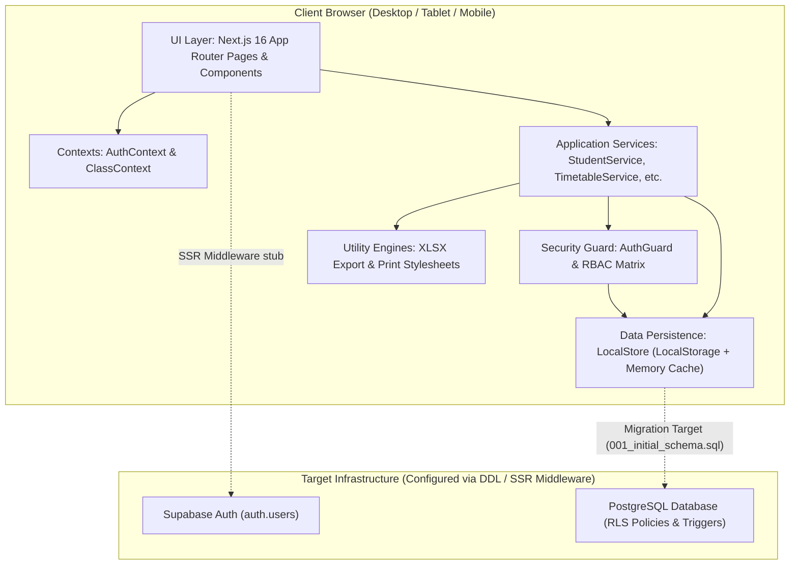

# System Architecture

## 1. High-Level Overview

**Class Manager** is a specialized school management application engineered for Vietnamese secondary schools (Trường THCS), with the reference implementation modeled on **Trường THCS Nguyễn Tất Thành** (School Year 2026–2027).

The system currently runs as a client-orchestrated, offline-capable Single Page Application (SPA) built with **Next.js 16 (App Router)** and **React 19**, structured with a strict **Application Service Layer** that isolates the user interface from data storage and enforces domain invariants and Role-Based Access Control (RBAC).



---

## 2. Multi-Tier Architectural Layers

The architecture consists of distinct, decoupled layers:

```text
┌────────────────────────────────────────────────────────────────────────┐
│                        1. Presentation / UI Layer                      │
│   - Next.js 16 App Router Pages (src/app/(dashboard)/*, (admin)/*)     │
│   - Shared Shell Layouts (Sidebar, AdminSidebar, MobileNav)            │
│   - Reusable UI Atoms (Button, Badge, Modal, Input, StateViews)        │
└───────────────────────────────────┬────────────────────────────────────┘
                                    │ Calls typed Service methods
                                    ▼
┌────────────────────────────────────────────────────────────────────────┐
│                    2. Context & Client State Layer                     │
│   - AuthContext (src/contexts/auth-context.tsx): Active session & role │
│   - ClassContext (src/contexts/class-context.tsx): Active class state  │
│     and dynamic per-class role determination (GVCN vs GVBM)            │
└───────────────────────────────────┬────────────────────────────────────┘
                                    │ Injects User / Class Context
                                    ▼
┌────────────────────────────────────────────────────────────────────────┐
│                 3. Application Service & Domain Layer                  │
│   - Domain Services: StudentService, SeatingService, AttendanceService,│
│     TimetableService, ClassService, TeacherService, NoteService, etc.  │
│   - Security Enforcement: AuthGuard (src/services/auth-guard.ts)       │
│   - Data Invariants: Zod Schemas & Domain Rule Validation              │
│   - Return Contract: OperationResult<T> ({ success, data, error })     │
└───────────────────────────────────┬────────────────────────────────────┘
                                    │ Dispatches persistence commands
                                    ▼
┌────────────────────────────────────────────────────────────────────────┐
│                      4. Data Access / Repository Layer                 │
│   - LocalStore (src/lib/store.ts): Data Access Object (DAO) singleton  │
│   - Memory cache & localStorage sync                                   │
│   - Automatic versioning & schema migration (CURRENT_DATA_VERSION)     │
└───────────────────────────────────┬────────────────────────────────────┘
                                    │ Ready for migration
                                    ▼
┌────────────────────────────────────────────────────────────────────────┐
│                 5. Target PostgreSQL / Supabase Layer                  │
│   - Defined in supabase/migrations/001_initial_schema.sql              │
│   - Supabase SSR Client & Middleware (src/middleware.ts)               │
│   - PostgreSQL Triggers & Row-Level Security (RLS) policies            │
└────────────────────────────────────────────────────────────────────────┘
```

---

## 3. Communication Patterns

### 3.1. Synchronous Client-Side Method Invocation
Because the system operates primarily on an offline-first architecture, UI components do **not** trigger asynchronous HTTP `fetch` or GraphQL network calls. Instead, mutations and data queries execute synchronously against domain services:

```typescript
// Pattern in UI Components
const result = StudentService.createStudent(formData, currentClassId, user);
if (result.success) {
  toast.success('Thêm học sinh thành công');
  refreshData();
} else {
  toast.error(result.error);
}
```

### 3.2. Uniform Operation Result Contract
All mutating service operations return an `OperationResult<T>` tuple:
- `success`: Boolean indicating if the mutation passed authentication, authorization, schema validation, and domain invariants.
- `data`: Typed entity resulting from the mutation (if successful).
- `error`: User-facing localized Vietnamese error message explaining rejection reasons (e.g., class capacity exceeded, timetable teacher conflict).

```typescript
export type OperationResult<T = void> =
  | { success: true; data: T; error?: never }
  | { success: false; error: string; data?: never };
```

---

## 4. Key Architectural Boundaries & Decisions

| Architectural Boundary | Implementation | Inferred Rationale |
| :--- | :--- | :--- |
| **Strict Service Layer Isolation** | UI never directly accesses `LocalStore` or `localStorage`. All writes go through `src/services/*`. | *Inferred from implementation:* Enables 100% clean migration to Supabase or a REST/tRPC backend without altering any UI components. |
| **No Backend API Routes** | There are 0 route handlers (`route.ts`) and 0 Server Actions (`'use server'`). | *Confirmed fact:* The current application runs entirely client-side on Next.js 16 with deterministic mock state. |
| **Per-Class Contextual RBAC** | Teacher permissions are evaluated dynamically per selected class via `ClassMembership` and `SubjectAssignment`. | *Confirmed fact:* A single teacher can be `HOMEROOM_TEACHER` in 6A1 (full CRUD) and `SUBJECT_TEACHER` in 6A2 (read-only + attendance for their subject). |
| **Atomic Timetable Conflict Engine** | School-wide schedule validation scanning all 16 classes and 24 teachers before committing a slot. | *Confirmed fact:* Ensures a teacher cannot be double-booked across different classes at the same period. |
| **Dual-Shift Classroom Matrix** | Khối 6 & 9 attend Morning Shift (Periods 1–5); Khối 7 & 8 attend Afternoon Shift (Periods 6–10). | *Confirmed fact:* Matches the Ministry of Education standard two-shift school schedule in Vietnam. |
