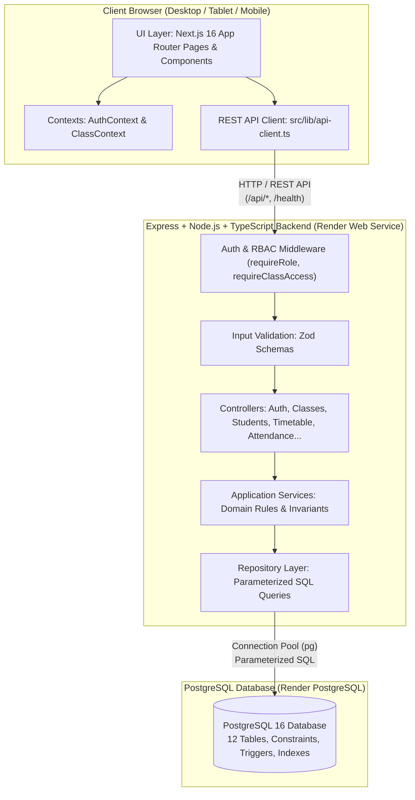

# System Architecture

## 1. High-Level Overview

**Class Manager** is an enterprise-grade school management application engineered for Vietnamese secondary schools (Trường THCS), with the reference implementation modeled on **Trường THCS Nguyễn Tất Thành** (School Year 2026–2027).

The system follows a modern decoupled full-stack architecture:
- **Frontend**: **Next.js 16 (App Router)** and **React 19**, structured with a centralized REST API client (`apiClient`) and React Context state.
- **Backend**: Dedicated **Node.js + Express + TypeScript** service enforcing authentication (bcrypt + JWT / HTTP-only cookies), domain-level Role-Based Access Control (RBAC), Zod request validation, and database transactions.
- **Database**: Relational **PostgreSQL** database managed via versioned SQL migrations and parameterized queries.
- **Deployment**: **Render Web Service** (Express REST API) and **Render PostgreSQL**.



---

## 2. Multi-Tier Architectural Layers

```text
┌────────────────────────────────────────────────────────────────────────┐
│                        1. Presentation / UI Layer                      │
│   - Next.js 16 App Router Pages (src/app/(dashboard)/*, (admin)/*)     │
│   - Shared Shell Layouts (Sidebar, AdminSidebar, MobileNav)            │
│   - Reusable UI Atoms (Button, Badge, Modal, Input, StateViews)        │
└───────────────────────────────────┬────────────────────────────────────┘
                                    │ HTTP requests via apiClient
                                    ▼
┌────────────────────────────────────────────────────────────────────────┐
│                     2. Context & Client State Layer                    │
│   - AuthContext (src/contexts/auth-context.tsx): Active session & user │
│   - ClassContext (src/contexts/class-context.tsx): Active class state  │
│   - Centralized API Client (src/lib/api-client.ts): REST API connector │
└───────────────────────────────────┬────────────────────────────────────┘
                                    │ REST API (/api/*) with credentials
                                    ▼
┌────────────────────────────────────────────────────────────────────────┐
│               3. Express Backend & Controller Layer                    │
│   - Routes & Controllers (backend/src/routes, backend/src/controllers) │
│   - Authentication Middleware: JWT verification & active user checks   │
│   - RBAC Middleware: requireRole, requireClassAccess, homeroom checks  │
│   - Request Validation: Zod schemas on params, query, and body         │
└───────────────────────────────────┬────────────────────────────────────┘
                                    │ Calls Domain Services
                                    ▼
┌────────────────────────────────────────────────────────────────────────┐
│               4. Application Service & Domain Layer                    │
│   - Domain Services: StudentService, SeatingService, AttendanceService,│
│     TimetableService, ClassService, TeacherService, NoteService, etc.  │
│   - Transaction Coordination: Atomic multi-step operations             │
│   - Strict Business Rules (Max 2 grades, Max 40 students, 1:1 seat)   │
└───────────────────────────────────┬────────────────────────────────────┘
                                    │ Invokes SQL Repositories
                                    ▼
┌────────────────────────────────────────────────────────────────────────┐
│                      5. Data Access / Repository Layer                 │
│   - Repositories: user.repo, class.repo, student.repo, seating.repo... │
│   - Parameterized SQL execution via 'pg' connection pool               │
│   - Zero SQL injection vulnerability (100% parameterized)              │
└───────────────────────────────────┬────────────────────────────────────┘
                                    │ SQL Queries over SSL
                                    ▼
┌────────────────────────────────────────────────────────────────────────┐
│                      6. PostgreSQL Database Tier                       │
│   - Managed PostgreSQL 16 on Render                                    │
│   - 12 Relational Tables with constraints, triggers, and indexes       │
│   - Migration scripts (backend/migrations/ 001 -> 006)                 │
└────────────────────────────────────────────────────────────────────────┘
```

---

## 3. Communication Patterns

### 3.1. Asynchronous REST API Client
The frontend communicates asynchronously with the backend REST API:

```typescript
// Pattern in UI Components
try {
  const result = await api.students.create(currentClassId, formData);
  toast.success('Thêm học sinh thành công');
  loadData();
} catch (err: any) {
  toast.error(err.message || 'Thao tác thất bại');
}
```

### 3.2. Authorization & Invariant Enforcement
The Express backend is authoritative. All requests pass through authentication and RBAC middlewares before controllers invoke domain services. Even if a client bypasses UI constraints, unauthorized requests are rejected with `401 Unauthorized` or `403 Forbidden`.
