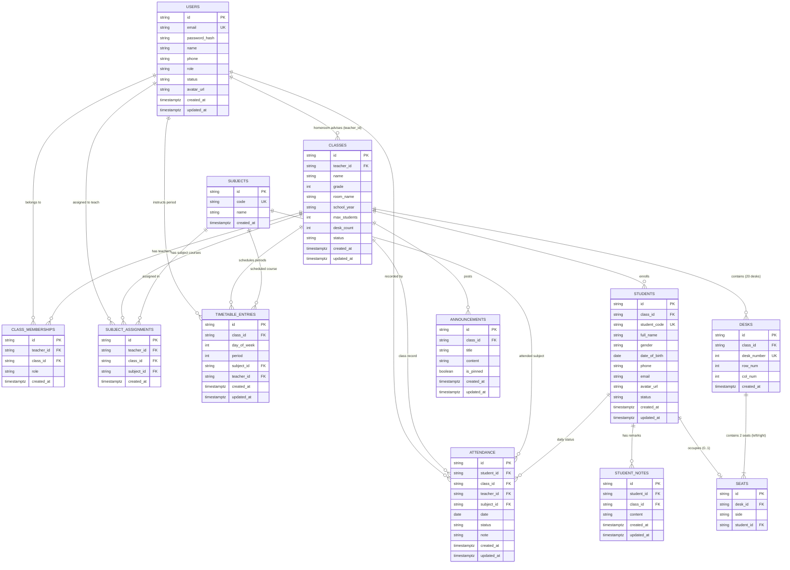

# Entity-Relationship (ER) Diagram

This diagram documents the complete PostgreSQL relational schema implemented in `backend/migrations/001_initial_schema.sql`.

```mermaid
erDiagram
    USERS ||--o{ CLASSES : "homeroom advises (teacher_id)"
    USERS ||--o{ CLASS_MEMBERSHIPS : "belongs to"
    USERS ||--o{ SUBJECT_ASSIGNMENTS : "assigned to teach"
    USERS ||--o{ TIMETABLE_ENTRIES : "instructs period"
    USERS ||--o{ ATTENDANCE : "recorded by"

    CLASSES ||--o{ CLASS_MEMBERSHIPS : "has teachers"
    CLASSES ||--o{ SUBJECT_ASSIGNMENTS : "has subject courses"
    CLASSES ||--o{ TIMETABLE_ENTRIES : "schedules periods"
    CLASSES ||--o{ STUDENTS : "enrolls"
    CLASSES ||--o{ DESKS : "contains (20 desks)"
    CLASSES ||--o{ ANNOUNCEMENTS : "posts"
    CLASSES ||--o{ ATTENDANCE : "class record"

    SUBJECTS ||--o{ SUBJECT_ASSIGNMENTS : "assigned in"
    SUBJECTS ||--o{ TIMETABLE_ENTRIES : "scheduled course"
    SUBJECTS ||--o{ ATTENDANCE : "attended subject"

    STUDENTS ||--o{ ATTENDANCE : "daily status"
    STUDENTS ||--o{ STUDENT_NOTES : "has remarks"
    STUDENTS ||--o| SEATS : "occupies (0..1)"

    DESKS ||--|{ SEATS : "contains 2 seats (left/right)"

    USERS {
        string id PK
        string email UK
        string password_hash
        string name
        string phone
        string role
        string status
        string avatar_url
        timestamptz created_at
        timestamptz updated_at
    }

    SUBJECTS {
        string id PK
        string code UK
        string name
        timestamptz created_at
    }

    CLASSES {
        string id PK
        string teacher_id FK
        string name
        int grade
        string room_name
        string school_year
        int max_students
        int desk_count
        string status
        timestamptz created_at
        timestamptz updated_at
    }

    CLASS_MEMBERSHIPS {
        string id PK
        string teacher_id FK
        string class_id FK
        string role
        timestamptz created_at
    }

    SUBJECT_ASSIGNMENTS {
        string id PK
        string teacher_id FK
        string class_id FK
        string subject_id FK
        timestamptz created_at
    }

    TIMETABLE_ENTRIES {
        string id PK
        string class_id FK
        int day_of_week
        int period
        string subject_id FK
        string teacher_id FK
        timestamptz created_at
        timestamptz updated_at
    }

    STUDENTS {
        string id PK
        string class_id FK
        string student_code UK
        string full_name
        string gender
        date date_of_birth
        string phone
        string email
        string avatar_url
        string status
        timestamptz created_at
        timestamptz updated_at
    }

    DESKS {
        string id PK
        string class_id FK
        int desk_number UK
        int row_num
        int col_num
        timestamptz created_at
    }

    SEATS {
        string id PK
        string desk_id FK
        string side
        string student_id FK
    }

    ATTENDANCE {
        string id PK
        string student_id FK
        string class_id FK
        string teacher_id FK
        string subject_id FK
        date date
        string status
        string note
        timestamptz created_at
        timestamptz updated_at
    }

    ANNOUNCEMENTS {
        string id PK
        string class_id FK
        string title
        string content
        boolean is_pinned
        timestamptz created_at
        timestamptz updated_at
    }

    STUDENT_NOTES {
        string id PK
        string student_id FK
        string class_id FK
        string content
        timestamptz created_at
        timestamptz updated_at
    }
```
