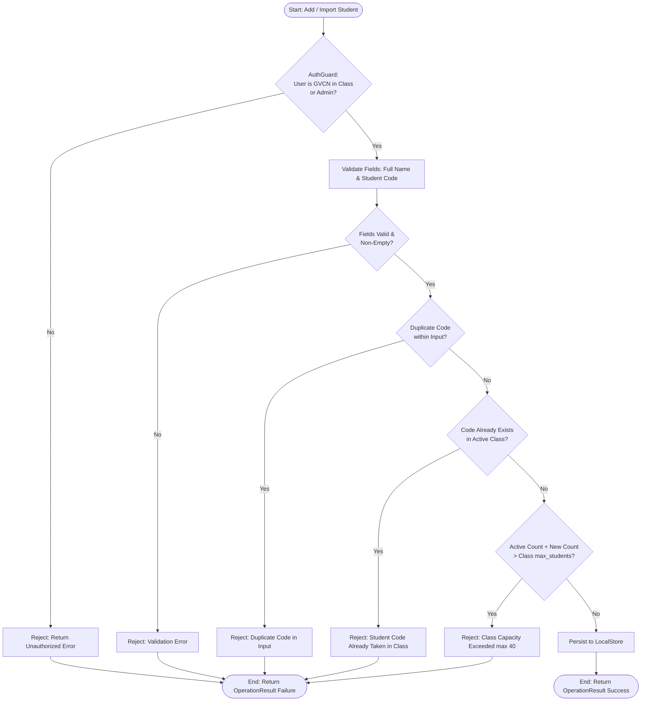
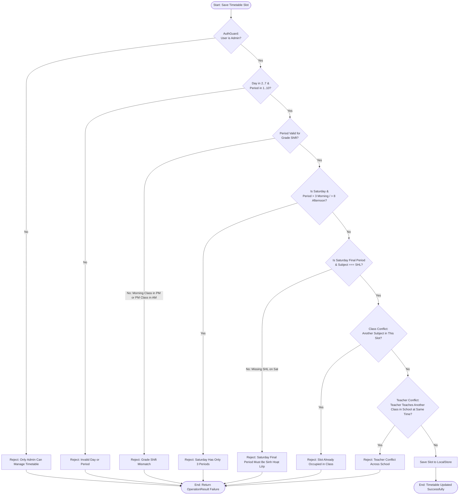
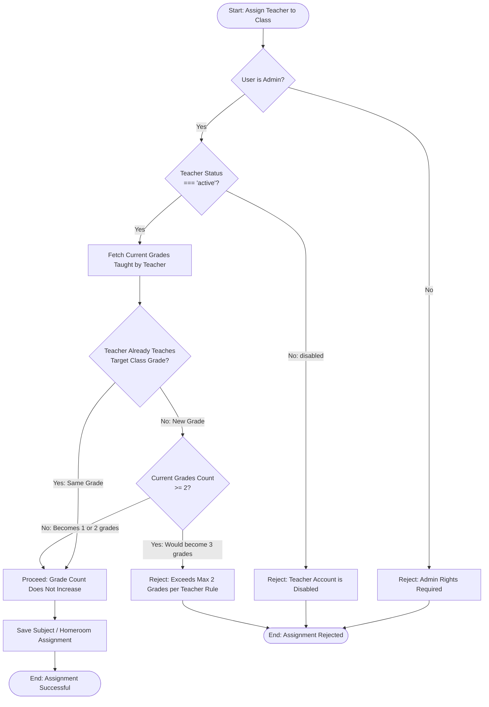

# Activity Diagrams

This document contains flowcharts detailing the core decision processes and validation logic across the system.

---

## 1. Student Enrollment & Import Activity Flow

---

## 2. Timetable Slot Validation & Conflict Prevention

---

## 3. Teacher Allocation & 2-Grade Limit Check

