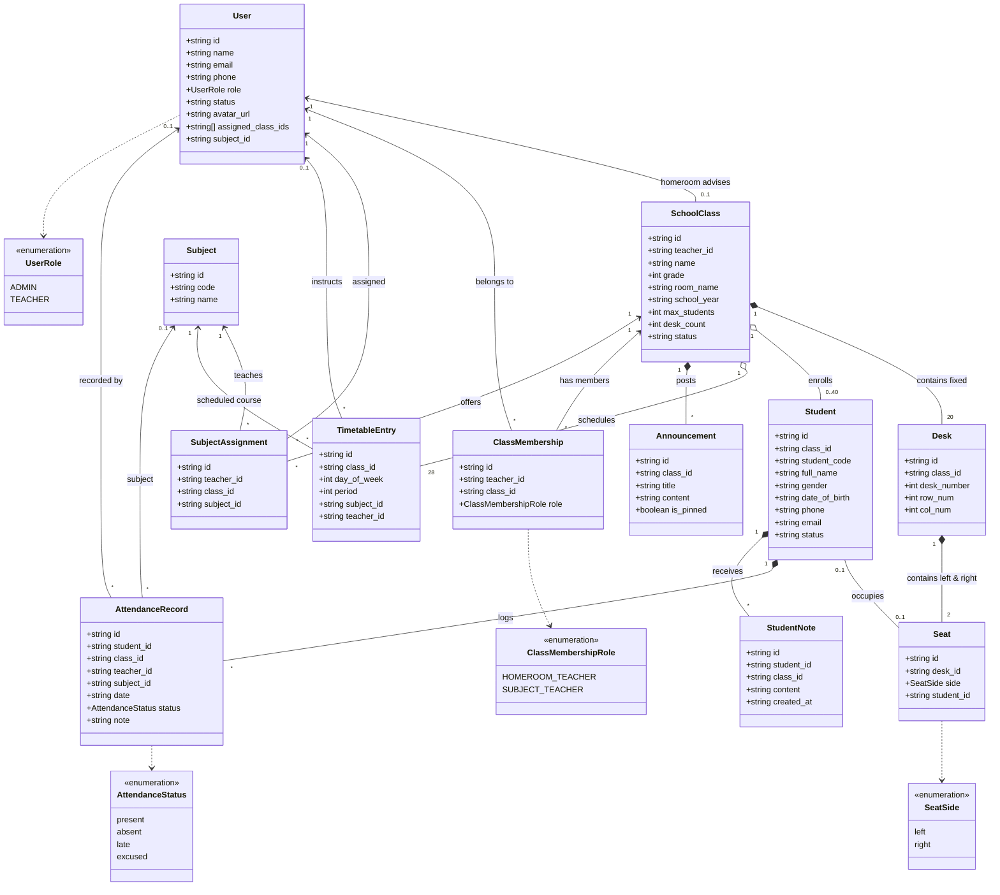

# Class Diagrams

This document specifies the UML Class Diagrams for the **Class Manager** system based directly on the active implementation across `frontend/src/types/`, `frontend/src/services/`, `frontend/src/lib/store.ts`, and `frontend/src/lib/auth.ts`.

To maintain readability and technical precision, the class architecture is presented in two focused diagrams:
1. **Domain Model & Entity Class Diagram**: Represents core business entities, value objects, structural compositions, and associations.
2. **Application Service & Persistence Architecture Class Diagram**: Represents the Domain Service Layer, security guards, repository pattern, and client context providers.

---

## 1. Domain Model & Entity Class Diagram

This diagram captures the structural relationships between the school domain entities defined in `frontend/src/types/index.ts`.

### Entity Relationship Details
* **`SchoolClass` $\rightarrow$ `Desk`:** Fixed Composition (`1 *-- 20`). Standard secondary classroom geometry (20 double desks).
* **`Desk` $\rightarrow$ `Seat`:** Fixed Composition (`1 *-- 2`). Each desk contains exactly 2 physical seats (`left` and `right`).
* **`Student` $\leftrightarrow$ `Seat`:** Invariant 1-to-1 Association (`0..1 -- 0..1`). A student occupies at most one seat; a seat has at most one student occupant.
* **`SchoolClass` $\rightarrow$ `Student`:** Aggregation (`1 o-- 0..40`). Enrolls up to `max_students <= 40`.
* **`SchoolClass` $\rightarrow$ `TimetableEntry`:** Standard secondary weekly schedule of 28 periods (`5 periods M–F + 3 periods Sat`).

---

## 2. Application Service & Persistence Architecture Class Diagram

This diagram models the Service-Layer Architecture, detailing the separation between UI Contexts, Domain Services, Security Guards, and the `LocalStore` Repository DAO.

```mermaid
classDiagram
    direction TB

    %% Application Contexts
    class AuthContext {
        +User user
        +UserRole role
        +boolean isAuthenticated
        +boolean isLoading
        +login(email, password)
        +logout()
        +refreshUser()
    }

    class ClassContext {
        +string currentClassId
        +SchoolClass currentClass
        +SchoolClass[] assignedClasses
        +ClassMembershipRole classRole
        +boolean isHomeroom
        +boolean isSubjectTeacher
        +Subject[] teacherSubjects
        +switchClass(classId)
        +refreshClasses()
    }

    %% Security & Authorization Guard
    class AuthGuard {
        <<stateless utility>>
        +isAdmin(user) boolean
        +isHomeroomTeacher(user, classId) boolean
        +hasAccessToClass(user, classId) boolean
        +canViewTimetable(user, classId) boolean
        +canManageTimetable(user, classId) boolean
        +canEditStudent(user, classId) boolean
        +canManageSeating(user, classId) boolean
        +canManageAttendance(user, classId, subjectId) boolean
        +canViewAttendance(user, classId, subjectId) boolean
        +canAttendPeriod(user, classId, day, period) boolean
        +canManageTeacherAssignment(user) boolean
        +assert(condition, message) void
    }

    %% Application Domain Services
    class StudentService {
        <<service>>
        +getStudents(classId) Student[]
        +getStudentById(id) Student
        +createStudent(data, classId, user) OperationResult
        +importStudents(classId, list, user) OperationResult
        +updateStudent(id, data, user) OperationResult
        +deleteStudent(id, user) OperationResult
    }

    class SeatingService {
        <<service>>
        +getDesks(classId) DeskWithSeats[]
        +assignSeat(seatId, studentId, classId, user) OperationResult
        +swapSeats(seat1, seat2, classId, user) OperationResult
        +randomizeSeating(classId, user) OperationResult
        +clearAllSeats(classId, user) OperationResult
    }

    class AttendanceService {
        <<service>>
        +getAttendanceRecords(classId, subjectId, user) AttendanceRecord[]
        +getAttendanceForDate(date, classId, subjectId, user) AttendanceRecord[]
        +saveAttendanceBatch(date, entries, classId, subjectId, user) OperationResult
        +getAttendanceHistory(classId) HistoryResult
    }

    class TimetableService {
        <<service>>
        +getTimetableForClass(classId, user) TimetableEntry[]
        +getCurrentPeriodInfo(now) CurrentPeriodInfo
        +getCurrentSession(classId, now) CurrentSessionInfo
        +checkClassConflict(classId, day, period, excludeId) Conflict
        +checkTeacherConflict(teacherId, day, period, excludeId) Conflict
        +validateTimetableEntry(entry) ValidationResult
        +saveEntry(classId, day, period, subjectId, teacherId, user) OperationResult
        +deleteEntry(id, user) OperationResult
        +copyTimetable(sourceId, targetId, user) OperationResult
        +applyStandardTemplate(classId, user) OperationResult
    }

    class TeacherService {
        <<service>>
        +getTeachers() User[]
        +getTeacherDetails(teacherId) TeacherDetails
        +checkGradeLimit(teacherId, classId) LimitCheckResult
        +assignHomeroomTeacher(classId, teacherId, user) OperationResult
        +assignSubjectTeacher(classId, subjectId, teacherId, user) OperationResult
    }

    class ClassService {
        <<service>>
        +updateClassSettings(classId, data, user) OperationResult
        +createClass(data, user) OperationResult
    }

    class AdminReportService {
        <<service>>
        +getSchoolAttendanceOverview() SchoolAttendanceOverview
        +getGradeAttendanceStats() GradeAttendanceStat[]
        +getClassAttendanceStats() ClassAttendanceStat[]
        +getHighAbsenceClasses() ClassAttendanceStat[]
        +generateSchoolReportWorkbookData() SchoolReportWorkbookData
    }

    class AuthService {
        <<service>>
        +getSession() AuthSession
        +getCurrentUser() User
        +login(email, password) AuthResult
        +logout() void
        +getTeacherClassInfo(user, classId) RoleInfo
        +getAssignedClassesForUser(user) SchoolClass[]
    }

    %% Persistence Repository (DAO)
    class LocalStore {
        <<repository singleton>>
        -object memoryCache
        +getUsers() User[]
        +getClasses() SchoolClass[]
        +getStudents(classId) Student[]
        +getDesks(classId) DeskWithSeats[]
        +getAttendanceRecords(classId, subjectId) AttendanceRecord[]
        +getTimetable(classId) TimetableEntry[]
        +getAllTimetables() TimetableEntry[]
        +addStudent(data, classId) Student
        +addStudentsBatch(list, classId) Student[]
        +updateStudent(id, data) Student
        +deleteStudent(id) boolean
        +assignSeat(seatId, studentId, classId) void
        +swapSeats(seat1, seat2, classId) void
        +randomizeSeating(classId) DeskWithSeats[]
        +saveAttendanceBatch(date, entries, classId, subjectId, teacherId) void
        +saveTimetableEntry(entry) TimetableEntry
        +assignHomeroomTeacher(classId, teacherId) void
        +assignSubjectTeacher(classId, subjectId, teacherId) void
    }

    %% Dependency & Usage Relations
    AuthContext ..> AuthService : invokes
    ClassContext ..> AuthService : resolves per-class role
    ClassContext ..> LocalStore : reads class metadata

    StudentService ..> AuthGuard : enforces canEditStudent
    StudentService ..> LocalStore : persists

    SeatingService ..> AuthGuard : enforces canManageSeating
    SeatingService ..> LocalStore : persists

    AttendanceService ..> AuthGuard : enforces canManageAttendance
    AttendanceService ..> LocalStore : persists

    TimetableService ..> AuthGuard : enforces canManageTimetable
    TimetableService ..> LocalStore : queries & persists

    TeacherService ..> AuthGuard : enforces canManageTeacherAssignment
    TeacherService ..> LocalStore : queries & persists

    ClassService ..> AuthGuard : enforces canEditClassSettings
    ClassService ..> LocalStore : persists

    AdminReportService ..> LocalStore : aggregates metrics
    AuthGuard ..> LocalStore : verifies memberships
    AuthService ..> LocalStore : authenticates users
```

---

## 3. Structural Highlights & Design Patterns

1. **Service Layer Boundary:**
   UI components communicate exclusively with Domain Services (`StudentService`, `AttendanceService`, `TimetableService`, etc.) through typed method calls, isolating UI logic from storage mechanisms.
2. **Defensive Authorization (`AuthGuard`):**
   Every service operation asserts permissions (`AuthGuard.canEditStudent`, `AuthGuard.canManageAttendance`) before invoking persistence methods on `LocalStore`.
3. **Repository Pattern (`LocalStore`):**
   `LocalStore` serves as a unified DAO (Data Access Object) providing synchronous querying and transactional mutations backed by an in-memory cache and browser `localStorage`.
4. **Contextual Role Resolution:**
   `AuthService.getTeacherClassInfo` and `ClassContext` compute active roles (`HOMEROOM_TEACHER` vs `SUBJECT_TEACHER`) on demand per selected class without modifying global user entities.
