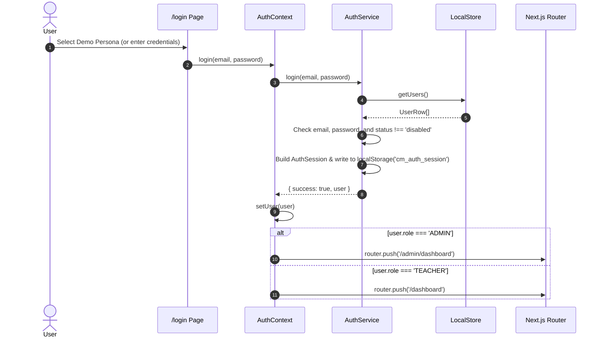
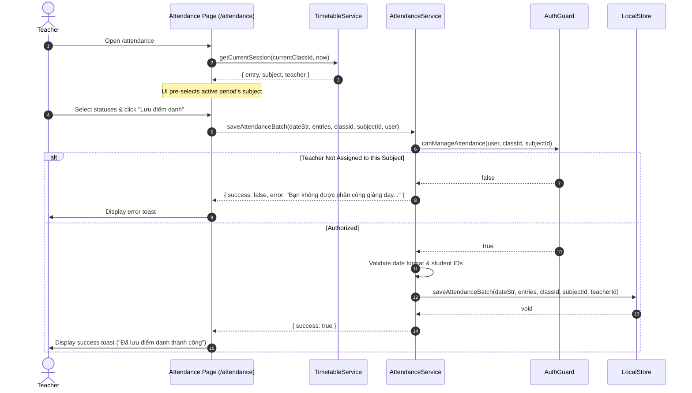
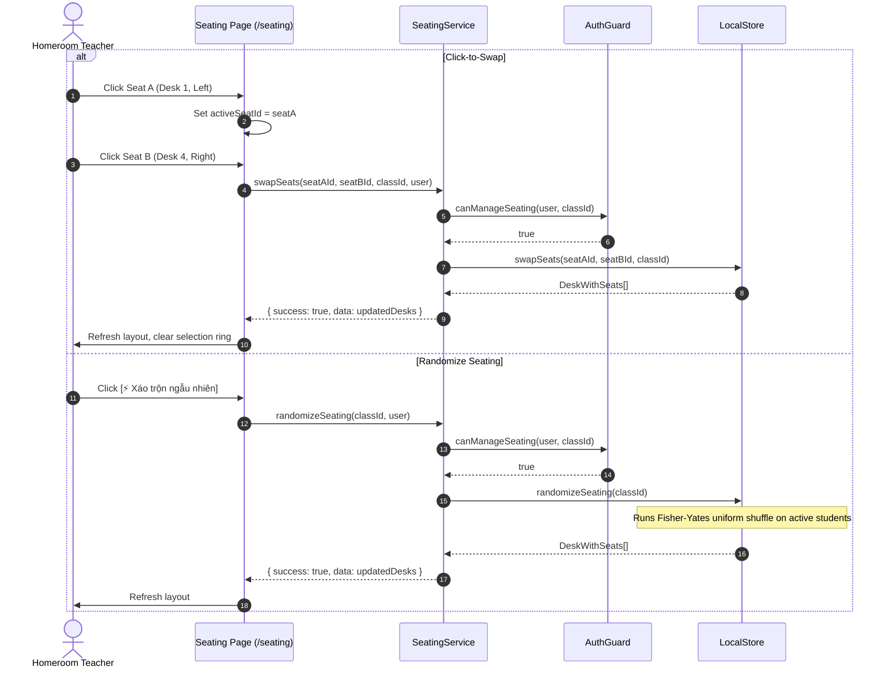
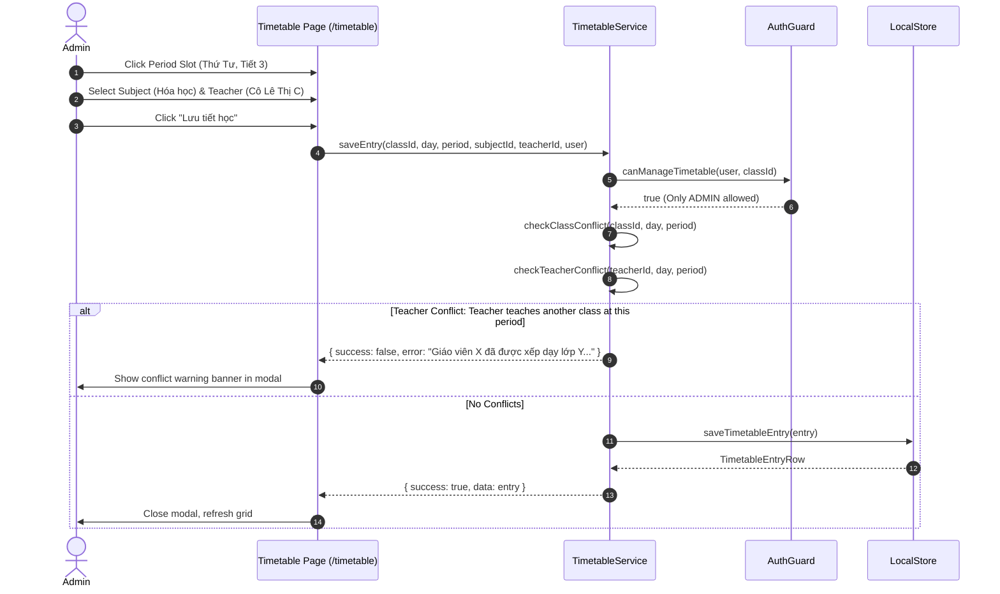
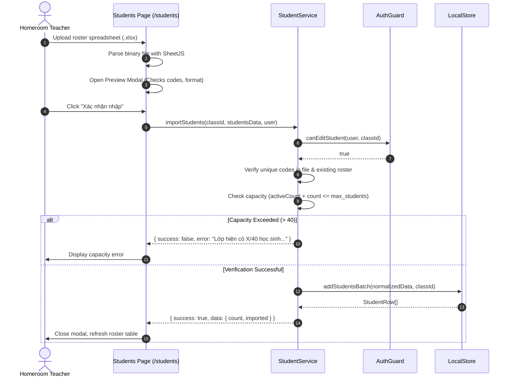
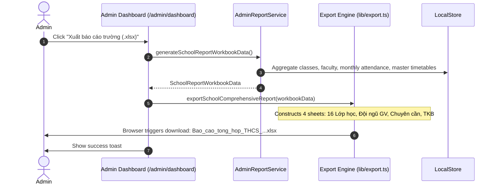

# Sequence Diagrams

This document collects the authoritative sequence diagrams for the primary business flows of the application.

---

## 1. Authentication & Session Bootstrap

---

## 2. Attendance Recording with Pedagogical RBAC

---

## 3. Seating Chart Click-to-Swap & Fisher-Yates Shuffle

---

## 4. Timetable Slot Creation & School-Wide Conflict Engine

---

## 5. Bulk Student Excel Import

---

## 6. Admin School-Wide 4-Sheet Report Export

