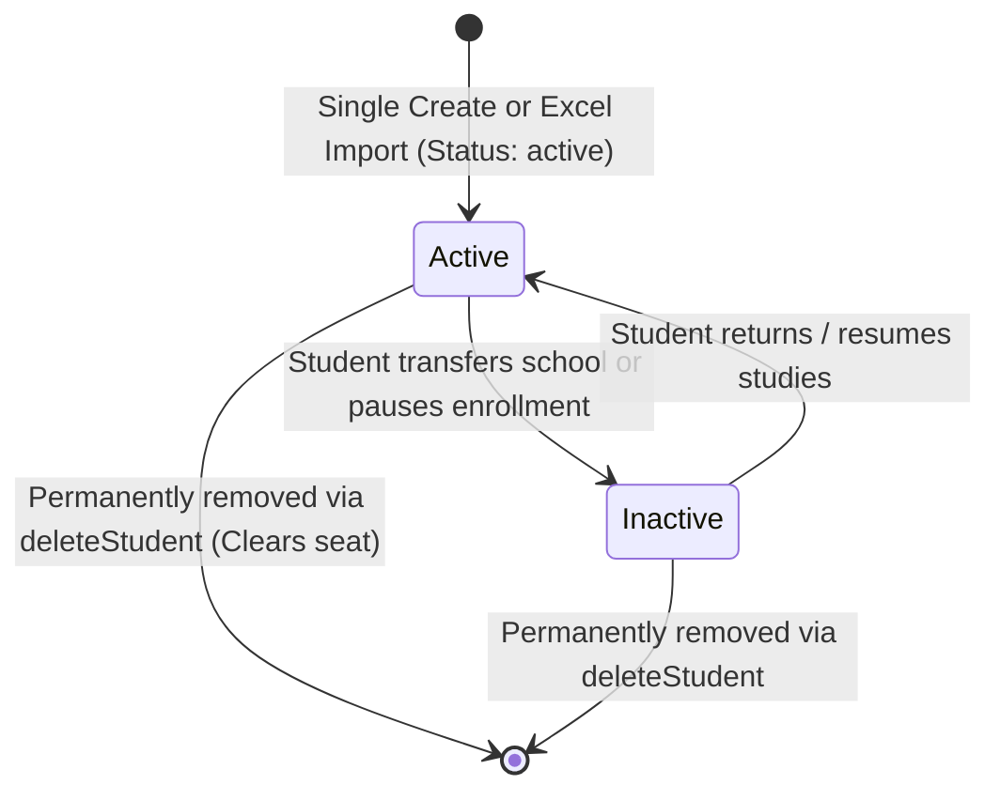
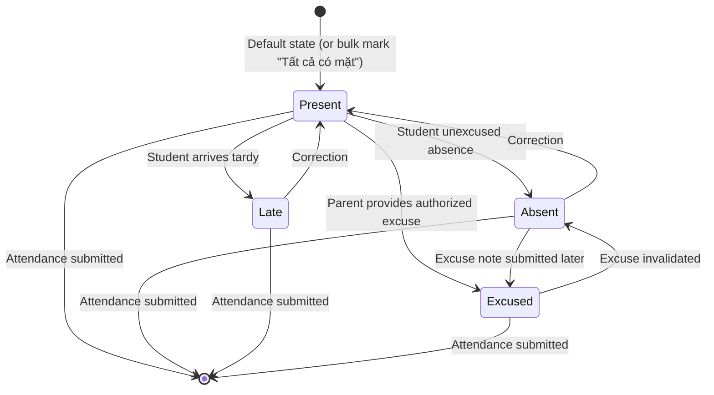
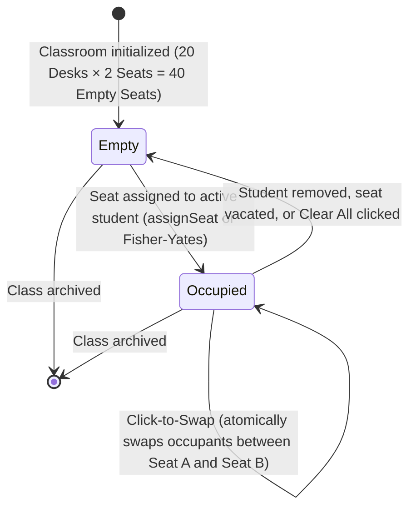
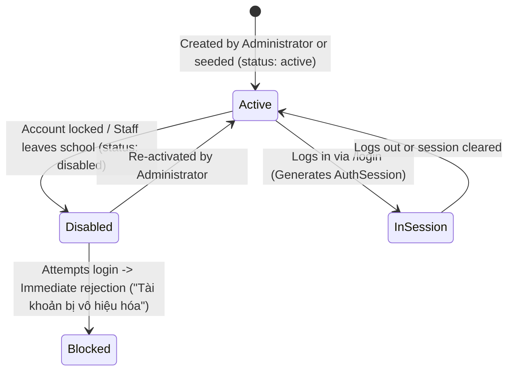
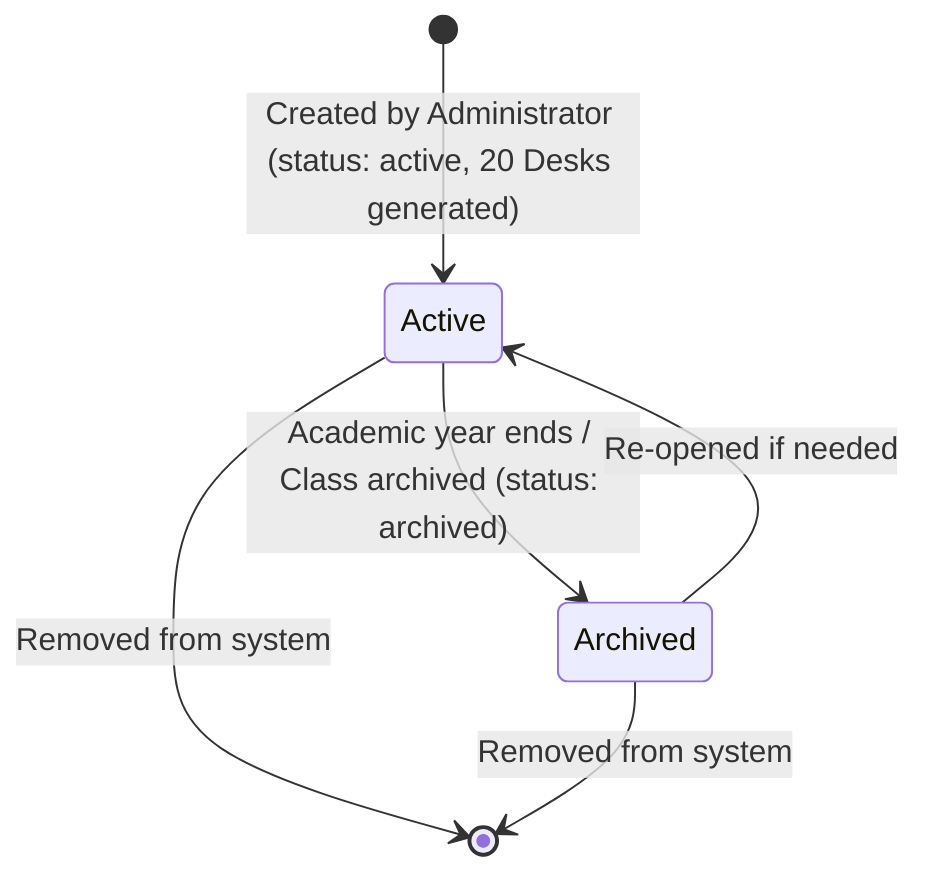

# State & Lifecycle Diagrams

This document illustrates the lifecycle states and valid transitions for the core entities in the system.

---

## 1. Student Enrollment Lifecycle

* **States:**
  - `active`: Enrolled student attending classes. Counts toward the class capacity ceiling (`max_students <= 40`).
  - `inactive`: Student record preserved for historical tracking, but does not occupy classroom seats.
* **Invariants:** Only `active` students can be seated in the 20-desk classroom layout or marked in daily attendance.

---

## 2. Daily Attendance Session States

* **Values:**
  - `present`: Có mặt (Emerald badge `✓`)
  - `absent`: Vắng không phép (Rose badge `✕`)
  - `late`: Đi muộn (Amber badge `⏱`)
  - `excused`: Vắng có phép (Slate badge `📋`)

---

## 3. Classroom Seat Allocation Lifecycle

---

## 4. User Account Lifecycle

---

## 5. Class Lifecycle

