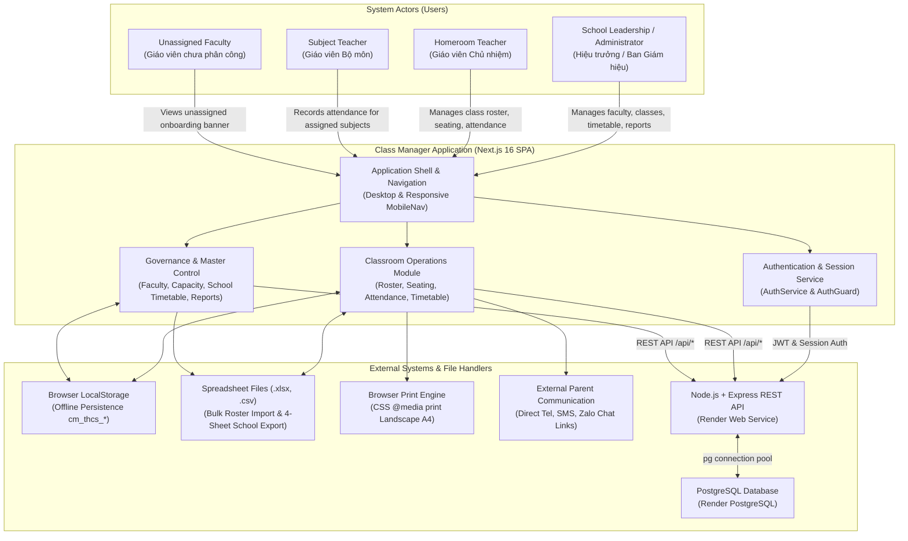

# System Context & Actor Boundaries

## 1. System Context Diagram (C4-Style)

The diagram below documents the actors, system boundaries, and external integration touchpoints of the Class Manager platform.

---

## 2. External Integration Touchpoints

| Touchpoint | Type | Description | File / Location |
| :--- | :--- | :--- | :--- |
| **Browser Storage** | Read/Write | Persists state across browser reloads using keys `cm_thcs_*`. | `frontend/src/lib/store.ts` |
| **Excel Parser (`xlsx`)** | Ingest | Parses binary `.xlsx`/`.csv` files for bulk student roster imports. | `frontend/src/app/(dashboard)/students/page.tsx` |
| **Excel Generator (`xlsx`)** | Egest | Generates multi-sheet Excel files for school reporting and attendance matrices. | `frontend/src/lib/export.ts` |
| **Print Engine (`@media print`)** | Egest | Renders borderless, landscape A4 pages for classroom seating charts and weekly timetables. | `frontend/src/app/globals.css` |
| **Parent Telephony / Zalo** | Egest URI | Launches `tel:`, `sms:`, and `https://zalo.me/` protocol handlers for 1-touch parent communication. | `frontend/src/app/(dashboard)/students/[id]/page.tsx` |
| **Express REST API Client** | Network | Centralized REST client calling backend endpoints via Next.js proxy or direct base URL. | `frontend/src/lib/api-client.ts`, `backend/src/*` |
| **Render PostgreSQL** | Database | Relational database hosting 12 normalized tables with triggers, indexes, and constraints. | `backend/src/config/database.ts` |

