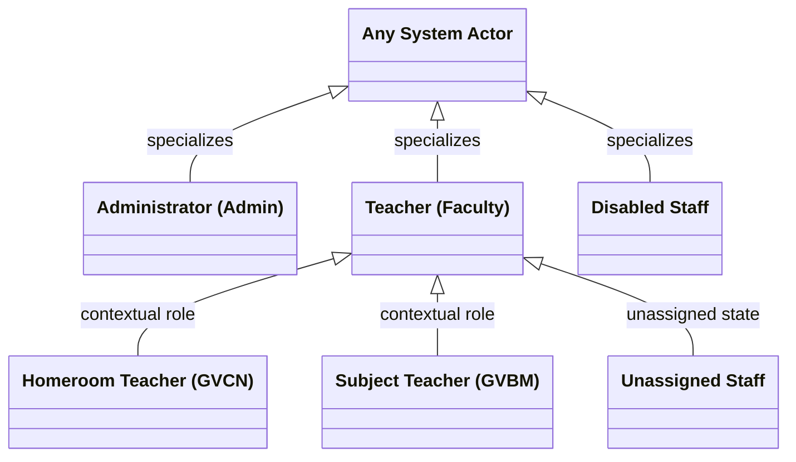
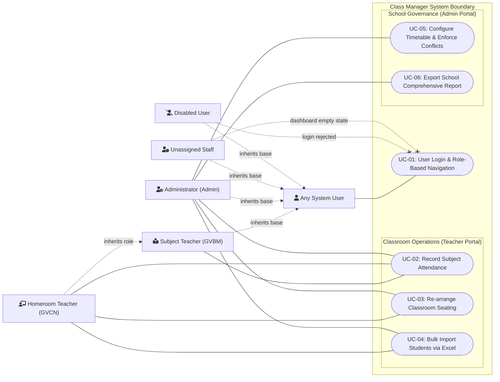
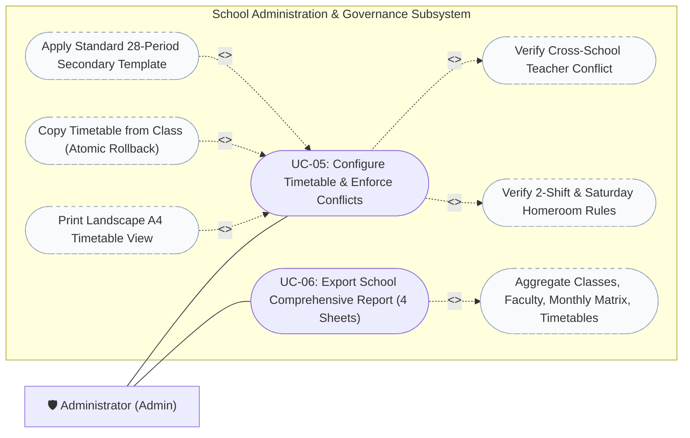

# Use Case Diagrams

This document defines the formal UML Use Case Diagrams for the **Class Manager** system, derived directly from the authoritative specifications in [`docs/requirements/use-cases.md`](../requirements/use-cases.md) (UC-01 to UC-06) and aligned with the security rules in [`docs/security/authorization.md`](../security/authorization.md).

---

## 1. System Actors & Hierarchy

The system defines 5 concrete actors based on user status and assigned class roles:



* **Administrator (`ADMIN`):** Global school governance, master timetable management, 4-sheet reporting, and teacher allocations.
* **Homeroom Teacher (`GVCN`):** Contextual class advisor with write privileges over student rosters, seating charts, and holistic monitoring.
* **Subject Teacher (`GVBM`):** Contextual instructor restricted to viewing assigned class rosters and recording attendance for their designated subject.
* **Unassigned Staff:** Authenticated teacher with no assigned classes; receives the onboarding empty-state screen.
* **Disabled User:** Staff account marked `status = 'disabled'`; blocked at login and across all domain services.

---

## 2. High-Level System Use Case Diagram

This diagram captures the complete boundary of the Class Manager system and connects all actors to use cases **UC-01 through UC-06**.



---

## 3. Detailed Use Case Diagram: Classroom Operations (Teacher Portal)

Focuses on **UC-02**, **UC-03**, and **UC-04**, highlighting the operational differences between Homeroom Teachers (GVCN), Subject Teachers (GVBM), and Administrators, along with standard `<<include>>` and `<<extend>>` behaviors.

```mermaid
flowchart LR
    %% Actors
    GVBM["👤 Subject Teacher (GVBM)"]
    GVCN["👤 Homeroom Teacher (GVCN)"]
    Admin["🛡️ Administrator (Admin)"]

    subgraph ClassroomOps ["Classroom Operations Subsystem"]
        %% UC-02 Attendance
        UC02(["UC-02: Record Subject Attendance"])
        UC02_Detect(["Detect Ongoing Period & Subject"]):::subcase
        UC02_BGH(["Copy Morning Absence Summary (BGH Report)"]):::subcase

        %% UC-03 Seating
        UC03(["UC-03: Re-arrange Classroom Seating (Click-to-Swap)"])
        UC03_Shuffle(["Randomize Seating (Fisher-Yates)"]):::subcase
        UC03_Overlay(["Toggle Live Attendance Overlay"]):::subcase
        UC03_Print(["Print Landscape A4 Seating Chart"]):::subcase

        %% UC-04 Student Import
        UC04(["UC-04: Bulk Import Students via Excel"])
        UC04_Validate(["Pre-Validate Capacity (<= 40) & Duplicate Codes"]):::subcase
        UC04_Template(["Download Sample Template (mau_danh_sach.xlsx)"]):::subcase
    end

    classDef subcase fill:#f8fafc,stroke:#94a3b8,stroke-dasharray: 5 5;

    %% Relationships for UC-02
    GVBM --- UC02
    GVCN --- UC02
    Admin --- UC02
    UC02 -.->|<<include>>| UC02_Detect
    UC02_BGH -.->|<<extend>>| UC02

    %% Relationships for UC-03
    GVCN --- UC03
    Admin --- UC03
    UC03_Shuffle -.->|<<extend>>| UC03
    UC03_Overlay -.->|<<extend>>| UC03
    UC03_Print -.->|<<extend>>| UC03

    %% Relationships for UC-04
    GVCN --- UC04
    Admin --- UC04
    UC04 -.->|<<include>>| UC04_Validate
    UC04_Template -.->|<<extend>>| UC04

    %% Constraints Note
    GVBM -.-x|View-only (no swap)| UC03
    GVBM -.-x|Denied roster write| UC04
```

---

## 4. Detailed Use Case Diagram: Administration & Master Governance

Focuses on **UC-05** and **UC-06**, showing centralized governance workflows and conflict protection invariants managed exclusively by the Administrator.



---

## 5. Actor-to-Use-Case Traceability Matrix

This table summarizes the permission matrix connecting actors to use cases **UC-01 through UC-06**:

| Use Case ID | Use Case Name | Primary Actor | Secondary / Permitted Actors | Access Level / Operational Boundary |
| :--- | :--- | :--- | :--- | :--- |
| **UC-01** | User Login & Role-Based Navigation | Any User | Admin, GVCN, GVBM, Unassigned | Authenticates session; Disabled accounts blocked; Unassigned routed to empty state. |
| **UC-02** | Record Subject Attendance | Subject Teacher (GVBM) | Homeroom Teacher (GVCN), Admin | Scoped strictly to assigned subject; GVCN has read-only view for other subjects. |
| **UC-03** | Re-arrange Classroom Seating | Homeroom Teacher (GVCN) | Admin | Swap, randomize, and clear 20 desks / 40 seats. GVBM restricted to view-only. |
| **UC-04** | Bulk Import Students via Excel | Homeroom Teacher (GVCN) | Admin | Imports roster with pre-validation (max 40 students ceiling, duplicate code checks). |
| **UC-05** | Configure Timetable & Enforce Conflicts | Administrator (Admin) | None (Teachers read-only) | Centralized management; atomic conflict prevention across all 16 classes. |
| **UC-06** | Export School Comprehensive Report | Administrator (Admin) | None | Generates 4-sheet master Excel workbook (`.xlsx`) covering entire school data. |

---

## 6. UML Relationship Justifications

* **`<<include>>` UC-02 $\rightarrow$ Detect Ongoing Period:** Recording attendance always reads the device clock and resolves the active period schedule via `TimetableService.getCurrentPeriodInfo()` to pre-select the ongoing subject.
* **`<<extend>>` Copy BGH Report $\rightarrow$ UC-02:** Copying the morning absence summary to clipboard is an optional helper action invoked on demand after viewing or saving attendance.
* **`<<include>>` UC-04 $\rightarrow$ Pre-Validate Capacity & Duplicate Codes:** Bulk student import cannot proceed without executing synchronous client validation verifying that `activeCount + importedCount <= class.max_students` (max 40) and that student codes are unique.
* **`<<include>>` UC-05 $\rightarrow$ Verify Cross-School Teacher Conflict:** A timetable slot cannot be committed without running `checkTeacherConflict()` across all 16 classes.
* **`<<extend>>` Copy Timetable / Apply Template $\rightarrow$ UC-05:** Applying templates or copying from another class are optional batch shortcuts extending single-slot timetable configuration.
* **`<<include>>` UC-06 $\rightarrow$ Aggregate 16-Class Master Data:** Generating the 4-sheet workbook fundamentally requires querying classes, teacher assignments, monthly attendance records, and all 448 timetable slots.
