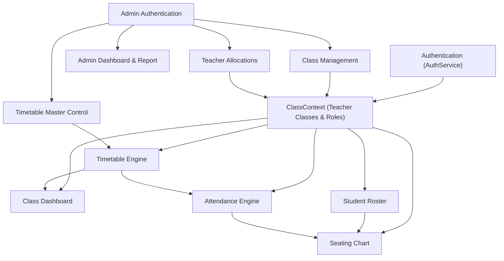

# Functional Overview

## 1. Functional Decomposition Tree

The system encompasses two primary operational portals: the **Teacher Portal** (`(dashboard)`) and the **Administration Portal** (`(admin)`), supported by an **Authentication & Security Engine**.

```text
Class Manager System
├── 1. Authentication & Session Management
│   ├── 1.1. Login via Email & Password
│   ├── 1.2. 1-Click Demo Accounts (Admin, GVCN+GVBM, Pure GVBM, Pure GVCN, Unassigned, Disabled)
│   ├── 1.3. Session Storage & Persistence
│   ├── 1.4. Automatic Role-Based Routing
│   └── 1.5. Disabled Account Roadblock
│
├── 2. Teacher Portal (Classroom Operations)
│   ├── 2.1. Contextual Class Switcher (Role-aware: GVCN vs. GVBM)
│   ├── 2.2. Classroom Executive Dashboard
│   │   ├── 2.2.1. Metric KPI Cards (Students, Attendance Rate, Occupied Desks, Announcements)
│   │   ├── 2.2.2. Today's Timetable Widget (Live status: Finished, Ongoing, Upcoming)
│   │   ├── 2.2.3. Seating Preview Dock
│   │   └── 2.2.4. Quick Action Dock
│   │
│   ├── 2.3. Student Roster Management
│   │   ├── 2.3.1. Filterable Student Table (Search, Gender, Status)
│   │   ├── 2.3.2. Single Student Creation / Editing / Deletion
│   │   ├── 2.3.3. Bulk Student Excel/CSV Import with Pre-validation Modal
│   │   ├── 2.3.4. Excel Export & Print Layout
│   │   └── 2.3.5. Student Detail View (Profile, Attendance Record, Parent Contact Card)
│   │
│   ├── 2.4. Interactive Seating Chart (4×5 Grid / 20 Desks / 40 Seats)
│   │   ├── 2.4.1. Dual Perspective Toggle (View from Back vs. View from Podium)
│   │   ├── 2.4.2. Click-to-Swap Seat Assignment
│   │   ├── 2.4.3. Fisher-Yates Uniform Seating Shuffle
│   │   ├── 2.4.4. Live Attendance Overlay (Badges on desks: Present, Absent, Late, Excused)
│   │   ├── 2.4.5. Gender Balance Visual Highlighter
│   │   ├── 2.4.6. Clear All Seats
│   │   └── 2.4.7. Official Landscape A4 Print View
│   │
│   ├── 2.5. Attendance & Discipline Engine
│   │   ├── 2.5.1. Real-Time Period Detection (Auto-selects active period and subject)
│   │   ├── 2.5.2. Period Quick-Select Bar (Jump across 5 daily periods)
│   │   ├── 2.5.3. 4-State Marking (Present, Absent, Late, Excused)
│   │   ├── 2.5.4. Quick Filter Tabs (All, Unaccounted/Absent, Present, Late, Excused)
│   │   ├── 2.5.5. 1-Click Copy Morning Absence Summary to Clipboard for BGH/Zalo
│   │   └── 2.5.6. Attendance History Matrix with Custom Date Range Filtering & KPIs
│   │
│   ├── 2.6. Timetable Schedule View
│   │   ├── 2.6.1. 2-Shift Grid (Morning: P1–P5; Afternoon: P6–P10)
│   │   ├── 2.6.2. Subject Color-Coded Schedule Cards
│   │   ├── 2.6.3. Read-Only Protection for Teachers
│   │   └── 2.6.4. Landscape A4 Print View with BGH/GVCN Signature Blocks
│   │
│   ├── 2.7. Class Bulletin Board (Announcements)
│   │   ├── 2.7.1. Create, Edit, Delete Announcements
│   │   └── 2.7.2. Pinning Priority Announcements
│   │
│   └── 2.8. Classroom Settings
│       ├── 2.8.1. Metadata Update (Name, Room, School Year)
│       ├── 2.8.2. Classroom Capacity Utilization Widget
│       └── 2.8.3. Reset Demo Data to Clean State
│
└── 3. Administration Portal (School Governance)
    ├── 3.1. Executive Management Dashboard (Visual & Information-Dense)
    │   ├── 3.1.1. Executive KPI Metrics (Faculty, Classes, Student Enrolment, Timetable Completion)
    │   ├── 3.1.2. Level 1 Diagnostic Alert Hub (Timetable Conflict Detection & High Absence Class Alerts)
    │   ├── 3.1.3. Timetable Overview & Shift Distribution (Morning/Afternoon split, Top Subject Allocation)
    │   ├── 3.1.4. Attendance Distribution & Grade Comparison Chart (Grades 6–9 Progress vs 95% Benchmark)
    │   ├── 3.1.5. Interactive Class Management Overview Table (Filter, Sort, Capacity, Timetable, Roll-call)
    │   ├── 3.1.6. Faculty Workload & Allocation Overview Table (Teaching Periods/Week, Homeroom, Conflict Health)
    │   ├── 3.1.7. Recent System Activity & Real-Time Diagnostics Log
    │   ├── 3.1.8. Quick Administrative Actions Toolbar
    │   └── 3.1.9. 4-Sheet Comprehensive School Report Excel Export (.xlsx)
    │
    ├── 3.2. Class Management
    │   ├── 3.2.1. 16 Classes Directory & Filtering
    │   ├── 3.2.2. Homeroom Teacher Allocation
    │   └── 3.2.3. Class Capacity & Room Configuration
    │
    ├── 3.3. Faculty & Subject Allocations
    │   ├── 3.3.1. 24 Teachers Directory & Filtering
    │   ├── 3.3.2. Teacher Profile & Assigned Classes View
    │   ├── 3.3.3. Subject Assignment Modal (10 Subjects)
    │   └── 3.3.4. Pedagogical Constraint Enforcement (Max 2 Grades per Teacher)
    │
    ├── 3.4. School-Wide Timetable Master Control
    │   ├── 3.4.1. Central Timetable Creation & Editing for All 16 Classes
    │   ├── 3.4.2. Standard 28-Period Secondary Template Generator
    │   ├── 3.4.3. Class-to-Class Timetable Copy Engine
    │   └── 3.4.4. Cross-School Teacher Conflict Detection Engine
    │
    └── 3.5. System Settings
        └── 3.5.1. School Profile & Academic Year Configuration
```

---

## 2. Feature Dependencies



---

## 3. Data Flow Between Functional Modules

1. **Timetable $\rightarrow$ Attendance:**
   - In `/attendance`, the system evaluates `TimetableService.getCurrentSession(classId, new Date())`.
   - If the active clock matches a scheduled period, that period's subject and assigned teacher are pre-selected in the UI.
2. **Attendance $\rightarrow$ Seating:**
   - When the teacher toggles `Trạng thái chuyên cần` in `/seating`, the seating chart queries `LocalStore.getAttendanceForDate(todayStr, classId)`.
   - Matching student seats render live status badges (`✓ Có mặt`, `✕ Vắng`, `⏰ Muộn`, `📋 Phép`).
3. **Student Roster $\rightarrow$ Seating:**
   - Only students currently active (`status = 'active'`) in the selected class appear in the unseated student tray.
   - Deleting a student automatically frees their assigned seat in the classroom desk grid.
4. **Teacher Assignment $\rightarrow$ Timetable:**
   - Assigning a subject teacher via the Admin Portal updates `SubjectAssignment`.
   - Timetable slots for that class automatically inherit the assigned teacher for that subject.
