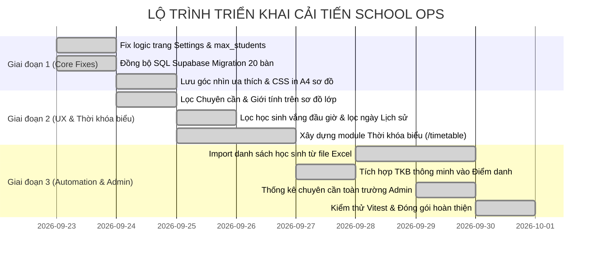

# SchoolOps — Kế Hoạch Cải Tiến & Nâng Cấp Hệ Thống (Improvement Plan)

> **Mục tiêu:** Nâng cấp, hoàn thiện và mở rộng hệ thống SchoolOps hiện tại từ nền tảng đã chạy tốt lên chuẩn sản phẩm thực tế cho Trường THCS Nguyễn Tất Thành.  
> **Quy chuẩn chốt:** 20 bàn / 40 học sinh / 4 dãy × 5 hàng / 2 góc nhìn / Đa lớp & Phân quyền RBAC.  
> **Thời gian áp dụng:** Kế hoạch thực hiện tiếp theo (Bắt đầu từ 23/09/2026).  

---

## I. HIỆN TRẠNG & ĐÁNH GIÁ ĐẦU VÀO

Hệ thống hiện tại đã hoàn thiện bộ khung chức năng cốt lõi (Core MVP & Prototype):
* **Đã chạy tốt:** 16 lớp THCS (6A1–9A4), 24 giáo viên, 10 môn học, 480 học sinh.
* **Đã chuẩn hóa:** Sơ đồ lớp 20 bàn / 40 chỗ ngồi, 2 góc nhìn không gian, thuật toán Fisher-Yates, phân quyền RBAC (Admin, GVCN, GVBM), điểm danh buổi & theo môn, xuất Excel, trang Login chuẩn bảo mật trường học.
* **Mục tiêu của Kế hoạch Cải tiến này:** Tập trung giải quyết các điểm chưa đồng bộ, nâng cao trải nghiệm thực tế cho giáo viên trong giờ dạy, tích hợp **Thời khóa biểu thông minh**, bổ sung các công cụ tự động hóa (Import Excel, in ấn A4, bộ lọc sơ đồ) và chuẩn hóa CSDL Supabase để sẵn sàng triển khai chính thức.

---

## II. DANH MỤC CÁC HẠNG MỤC CẢI TIẾN TRỌNG TÂM

```
┌────────────────────────────────────────────────────────────────────────────────────────┐
│                          HỆ THỐNG CẢI TIẾN SCHOOL OPS                               │
├───────────────────┬───────────────────┬──────────────────┬───────────────┬─────────────┤
│ 1. SƠ ĐỒ LỚP HỌC  │ 2. CÀI ĐẶT & DATA │ 3. ĐIỂM DANH &   │ 4. THỜI KHÓA  │ 5. ADMIN &  │
│    (SEATING MAP)  │    (CONSISTENCY)  │    HỌC SINH      │    BIỂU (TKB) │    HỆ THỐNG │
│    [ĐÃ XONG ✅]   │    [ĐÃ XONG ✅]   │   [ĐÃ XONG ✅]   │  [ĐÃ XONG ✅] │   [CHƯA LÀM]│
├───────────────────┼───────────────────┼──────────────────┼───────────────┼─────────────┤
│ • Lọc Chuyên cần  │ • Fix Settings    │ • Import Excel   │ • Lưới TKB    │ • Thống kê  │
│ • Lọc Giới tính   │ • Lưu max_students│ • Lọc vắng mặt   │   Thứ 2 - 7   │   toàn trường│
│ • In A4 chuẩn     │ • Đồng bộ Schema  │ • Lọc khoảng     │ • Tự động gắn │ • Báo cáo   │
│ • Lưu góc nhìn    │   Supabase 20 bàn │   ngày lịch sử   │   môn điểm danh│  tổng hợp  │
│   ưu thích        │ • Tối ưu Storage  │ • Thẻ liên hệ PH │ • In TKB dán  │ • Phân công │
│                   │                   │                  │   bảng tin    │   GV bộ môn │
└───────────────────┴───────────────────┴──────────────────┴───────────────┴─────────────┘
```

---

## 1. CẢI TIẾN 1 — SƠ ĐỒ LỚP HỌC (SEATING MAP ENHANCEMENTS) `[ĐÃ HOÀN THÀNH ✅]`

> **Trạng thái:** Đã triển khai hoàn tất, kiểm thử và đẩy lên nhánh `main` (Commit `64c880a`).

### 1.1. Lọc trực quan Chuyên cần hôm nay trên sơ đồ lớp `[ĐÃ XONG ✅]`
* **Vấn đề:** Giáo viên khi đứng lớp nhìn vào sơ đồ chỉ thấy tên học sinh mà không biết ngay em nào hôm nay đang vắng mặt hoặc đi muộn.
* **Giải pháp đã thực hiện:**
  * Thêm nút bật/tắt: `[👁 Trạng thái chuyên cần]` trên thanh công cụ sơ đồ lớp.
  * Nếu học sinh hôm nay **Vắng mặt**: Hiển thị viền đỏ và chấm trạng thái `Vắng` nổi bật trên ghế ngồi kèm pulse badge.
  * Nếu học sinh **Đi muộn**: Hiển thị viền vàng hổ phách và nhãn `Muộn`.
  * Nếu học sinh **Nghỉ có phép**: Hiển thị viền xanh lam nhạt và nhãn `Phép`.
  * Giúp giáo viên đứng trên bục giảng chỉ cần liếc sơ đồ là kiểm soát được chỗ trống thực tế trong phòng học.

### 1.2. Lọc trực quan Giới tính (Nam / Nữ) `[ĐÃ XONG ✅]`
* **Giải pháp đã thực hiện:**
  * Thêm bộ lọc: `Tất cả` | `Nam` | `Nữ`.
  * Highlight giới tính đã chọn (Xanh dương nhạt cho Nam, Hồng phấn nhạt cho Nữ) và làm mờ ghế không trùng khớp giúp giáo viên dễ dàng cân bằng tỷ lệ nam/nữ khi sắp xếp chỗ ngồi giữa các dãy.

### 1.3. Chuẩn hóa tính năng In sơ đồ lớp học ra khổ giấy A4 (Print Optimization) `[ĐÃ XONG ✅]`
* **Vấn đề:** Khi bấm nút "In sơ đồ", trình duyệt in kèm cả sidebar, thanh điều hướng và có thể bị co cụm vỡ trang.
* **Giải pháp đã thực hiện:**
  * Bổ sung CSS `@media print` chuyên biệt trong `globals.css` và `seating/page.tsx`:
    * Ẩn toàn bộ Sidebar, Header, thanh công cụ, nút bấm khi in.
    * Tự động ép xoay trang ngang (`@page { size: landscape; margin: 8mm; }`).
    * Bổ sung tiêu đề in trang trọng: *Trường THCS Nguyễn Tất Thành · Sơ đồ vị trí chỗ ngồi học sinh*.
    * Khung chữ ký chính thức của Ban Giám hiệu và Giáo viên chủ nhiệm ở cuối trang in.

### 1.4. Tự động ghi nhớ Góc nhìn ưa thích (Perspective Persistence) `[ĐÃ XONG ✅]`
* **Giải pháp đã thực hiện:** Lưu trạng thái `nhin_tu_duoi_len` hoặc `nhin_tu_buc_giang` vào `localStorage` theo key `cm_seating_perspective`, giữ nguyên góc nhìn ưa thích của giáo viên sau mỗi lần tải lại trang.

---

## 2. CẢI TIẾN 2 — CÀI ĐẶT LỚP HỌC & TÍNH NHẤT QUÁN DỮ LIỆU `[ĐÃ HOÀN THÀNH ✅]`

> **Trạng thái:** Đã triển khai hoàn tất, kiểm thử và đẩy lên nhánh `main` (Commit `5b13f59`).

### 2.1. Chuẩn hóa trang Cài đặt lớp (`frontend/src/app/(dashboard)/settings/page.tsx`) `[ĐÃ XONG ✅]`
* **Các việc đã xử lý:**
  1. Thay đổi state khởi tạo mặc định:
     * `maxStudents = '40'` (thay vì `'45'`).
     * `deskCount = '20'` (thay vì `'25'`).
  2. Cập nhật `classSettingsSchema` trong `frontend/src/lib/validations/forms.ts`:
     * Nhận thêm trường `max_students: z.coerce.number().min(1).max(40)`.
  3. Cập nhật `ClassService.updateClassSettings` và `LocalStore.updateClass`:
     * Chặn không cho hạ `max_students` thấp hơn số lượng học sinh đang học thực tế trong lớp.
     * Lưu giá trị `max_students` thật vào kho dữ liệu khi giáo viên bấm "Lưu thay đổi".
  4. Hiển thị khối Widget thông số trực quan:
     * **Sĩ số hiện tại:** `... / 40 học sinh` đang theo học.
     * **Số chỗ còn trống:** `... chỗ ngồi` khả dụng tiếp nhận.
     * **Tỷ lệ lấp đầy phòng học:** `...% công suất phòng (20 bàn)` kèm thanh tiến trình màu sắc động.

### 2.2. Đồng bộ lược đồ CSDL Supabase Migration (`supabase/migrations/001_initial_schema.sql` & `seed.sql`) `[ĐÃ XONG ✅]`
* **Các việc đã xử lý:**
  * Cập nhật ràng buộc bảng `classes`: `max_students <= 40`, `desk_count = 20`, `grade BETWEEN 6 AND 9`.
  * Cập nhật bảng `desks`: `desk_number BETWEEN 1 AND 20`, `row_num BETWEEN 1 AND 5`, `col_num BETWEEN 1 AND 4`.
  * Bảng `seats`: 40 chỗ ngồi (2 chỗ/bàn: `left` và `right`).
  * Bổ sung đầy đủ DDL cho các bảng quan hệ:
    * `profiles` (đồng bộ người dùng từ auth.users kèm role ADMIN/TEACHER)
    * `subjects` (id, code, name)
    * `class_memberships` (id, teacher_id, class_id, role)
    * `subject_assignments` (id, teacher_id, class_id, subject_id)
    * `timetable_entries` (id, class_id, day_of_week, period, subject_id, teacher_id)
  * Thiết lập các chính sách bảo mật hàng (Row Level Security - RLS) cho từng bảng với helper functions `is_admin()` và `has_class_access()`.
  * Đồng bộ `supabase/seed.sql` tạo 20 bàn (5 hàng × 4 cột) và 40 ghế ngồi chuẩn xác.
  * Bổ sung bộ test tự động `frontend/tests/class-settings.test.ts` (100% passed).

---

## 3. CẢI TIẾN 3 — ĐIỂM DANH & QUẢN LÝ HỌC SINH `[ĐÃ HOÀN THÀNH ✅]`

> **Trạng thái:** Đã triển khai hoàn tất 100%, vượt qua toàn bộ 27 test cases Vitest, kiểm tra kiểu TypeScript (`tsc --noEmit`), và đẩy lên nhánh `main` (Commit `fe0763b`).

### 3.1. Tính năng Nhập học sinh hàng loạt từ file Excel (Import Students via Excel/CSV) `[ĐÃ XONG ✅]`
* **Vấn đề:** Đầu năm học, GVCN phải nhập từng học sinh một rất mất thời gian.
* **Giải pháp cải tiến:**
  * Thêm nút `[📥 Nhập từ Excel]` trên trang danh sách học sinh.
  * Hỗ trợ tải file mẫu `mau_danh_sach_hoc_sinh.xlsx` (Cột: STT, Họ và tên, Mã HS, Giới tính, Ngày sinh, SĐT phụ huynh).
  * Modal xem trước (Preview) dữ liệu trước khi lưu:
    * Tự động kiểm tra trùng mã học sinh.
    * Tự động kiểm tra nếu tổng số vượt quá 40 em (báo lỗi không cho nhập).
    * Xác nhận và nạp nhanh toàn bộ vào lớp.

### 3.2. Cải tiến trải nghiệm Điểm danh nhanh (Attendance Quick Actions) `[ĐÃ XONG ✅]`
* **Giải pháp đã thực hiện:**
  * Lọc danh sách điểm danh: Bổ sung thanh tab lọc nhanh (`Tất cả`, `Chưa có mặt`, `Có mặt`, `Vắng`, `Muộn`, `Có phép`) kèm badge số lượng nổi bật.
  * Hỗ trợ tìm kiếm học sinh tức thì trong giờ điểm danh theo tên và mã học sinh.
  * Nút `[📋 Sao chép báo cáo BGH]` tự động tạo bản tin tóm tắt chuyên cần đầu giờ (Sĩ số, danh sách học sinh vắng/muộn chi tiết) để gửi nhanh qua Zalo/tin nhắn cho Ban Giám hiệu.

### 3.3. Bộ lọc thời gian nâng cao trong Lịch sử chuyên cần (`/history`) `[ĐÃ XONG ✅]`
* **Giải pháp đã thực hiện:**
  * Bổ sung bộ chọn khoảng ngày: `Tuần này` | `Tháng này` | `Tất cả` | `Tùy chọn khoảng ngày`.
  * Tính toán lại ma trận điểm danh và tỷ lệ chuyên cần theo đúng khoảng ngày đang được lọc thay vì chỉ tính toàn bộ niên khóa.
  * Bổ sung 4 thẻ KPI chuyên cần trong kỳ: Số buổi học, Tỷ lệ chuyên cần bình quân, Tổng lượt vắng, Tổng lượt đi muộn.
  * Xuất Excel và In báo cáo theo đúng khoảng thời gian được lọc.

### 3.4. Thẻ liên lạc phụ huynh trên trang Chi tiết học sinh (`/students/[id]`) `[ĐÃ XONG ✅]`
* **Giải pháp đã thực hiện:**
  * Xây dựng Thẻ liên hệ Phụ huynh & Gia đình chuyên nghiệp.
  * Bổ sung nút gọi nhanh (`tel:`), gửi SMS (`sms:`), và kết nối Zalo (`https://zalo.me/...`).
  * Hộp thoại **Mẫu tin nhắn 1-chạm** hỗ trợ các mẫu thông báo chuẩn trường học: Thông báo vắng mặt, Nhắc nhở đi muộn, Báo cáo chuyên cần định kỳ, Hẹn trao đổi với GVCN. Tự động điền tên học sinh, lớp, số buổi vắng/muộn và hỗ trợ sao chép hoặc gửi ngay.

---

## 4. CẢI TIẾN 4 — THỜI KHÓA BIỂU LỚP HỌC (CLASS TIMETABLE MODULE) `[ĐÃ HOÀN THÀNH ✅]`

> **Trạng thái:** Đã triển khai hoàn tất 100%, vượt qua toàn bộ 40 test cases Vitest (`frontend/tests/timetable.test.ts`), không lỗi TypeScript (`tsc --noEmit`).

Đây là **mảnh ghép liên kết thực tế** giữa thời gian học, môn học, giáo viên phụ trách và luồng điểm danh hằng ngày.

### 4.1. Bảng lưới Thời khóa biểu tương tác (`/timetable`) `[ĐÃ XONG ✅]`
* **Cấu trúc chuẩn:** 6 ngày học (Thứ Hai $\rightarrow$ Thứ Bảy) × 5 tiết buổi sáng (Tiết 1 $\rightarrow$ Tiết 5).
### 4.1. Lưới Thời khóa biểu tương tác (`frontend/src/app/(dashboard)/timetable/page.tsx`) `[ĐÃ XONG ✅]`
* **Phân chia ca học chuẩn theo Khối (28 tiết/lớp/tuần · 448 tiết toàn trường):**
  * **Khối 6 & Khối 9 → BUỔI SÁNG:** Thứ Hai – Thứ Sáu (Tiết 1–5), Thứ Bảy (Tiết 1–3). Cố định **Sinh hoạt lớp Thứ Bảy tại Tiết 3** do chính GVCN phụ trách.
  * **Khối 7 & Khối 8 → BUỔI CHIỀU:** Thứ Hai – Thứ Sáu (Tiết 6–10), Thứ Bảy (Tiết 6–8). Cố định **Sinh hoạt lớp Thứ Bảy tại Tiết 8** do chính GVCN phụ trách.
  * Không tạo Tiết 4/5 Thứ 7 sáng và Tiết 9/10 Thứ 7 chiều.
  * Khung giờ chuẩn: 45 phút/tiết, sinh hoạt đầu giờ 15 phút (07:00–07:15 & 12:45–13:00) và giờ giải lao không phải là tiết học.
* **Giao diện Ẩn/Hiện linh hoạt (Collapsible UI — Không bỏ hẳn hàng):**
  * Khối sáng hỗ trợ ẩn/hiện các hàng tiết chiều và ngược lại thông qua nút bấm thanh lọc và banner ca học. Các hàng không bị xóa bỏ hẳn mà giữ nguyên tính toàn vẹn của lưới học phần.
* **Phân quyền Thời khóa biểu (AuthGuard & Quản trị tập trung):**
  * **Giáo viên (`TEACHER`):** Hoàn toàn **không thể tự chỉnh sửa bất kỳ thứ gì liên quan tới thời khóa biểu** (không sửa môn, không đổi GV, không xếp mẫu, không sao chép hoặc xóa tiết). Giáo viên chỉ xem được thời khóa biểu của các lớp mình phụ trách giảng dạy (bao gồm lớp chủ nhiệm và lớp được phân công bộ môn).
  * **Quản trị viên (`ADMIN`):** Quản lý tập trung toàn trường; toàn quyền tạo, sửa, xếp mẫu, sao chép hoặc xóa TKB cho toàn bộ 16 lớp.
* **Nội dung mỗi ô tiết học:**
  * Tên môn học kèm mã môn và màu sắc nhận diện đặc trưng (Toán - Xanh dương, Ngữ văn - Xanh lá, Tiếng Anh - Tím, Vật lý - Cyan, Hóa học - Vàng hổ phách, Sinh học - Xanh cốm, Lịch sử - Đỏ hồng, Địa lý - Teal, Tin học - Indigo, Công nghệ - Stone, SHL - Indigo/Tím).
  * Tên giáo viên bộ môn phụ trách (tự động liên kết từ phân công chuyên môn `subject_assignments` của lớp).
* **Thao tác nghiệp vụ (Dành riêng cho Quản trị viên):**
  * Bấm vào bất kỳ ô tiết học để gán/đổi môn học, giáo viên tự động tra cứu và điền sẵn.
  * Hỗ trợ nút **[⚡ Xếp mẫu chuẩn]**: Áp dụng 28 tiết chuẩn phân bổ đều các môn THCS theo khối.
  * Hỗ trợ nút **[📋 Sao chép TKB]**: Sao chép thời khóa biểu từ lớp khác sang lớp hiện tại, tự động ánh xạ lại GVCN lớp đích vào Tiết 3 (Sáng) hoặc Tiết 8 (Chiều) Thứ Bảy.
  * Phân quyền RBAC: Chỉ Admin có quyền chỉnh sửa; Giáo viên hiển thị badge "Chế độ chỉ xem".
  * Hỗ trợ giao diện Responsive: Lưới ma trận chia 2 buổi trên Desktop và Tab chọn ngày linh hoạt trên Mobile.

### 4.2. Điểm danh thông minh theo thời gian thực (Smart Contextual Attendance) `[ĐÃ XONG ✅]`
* Khi giáo viên vào trang Điểm danh (`/attendance`), hệ thống tự động đối chiếu thứ trong tuần và giờ hiện tại:
  * Ví dụ: *Thứ Ba lúc 08:30* $\rightarrow$ Tự động nhận diện đang là **Tiết 2: Môn Toán (Thầy Nguyễn Văn An)**.
  * Hiển thị Banner thông minh với trạng thái: Đang điểm danh đúng môn, hoặc Gợi ý đổi nhanh 1-chạm sang môn học đang diễn ra.
  * Bổ sung **Thanh chọn tiết nhanh trong ngày**: Bấm 1 chạm vào bất kỳ tiết học nào (Tiết 1 $\rightarrow$ 5) để chuyển môn cần điểm danh tức thì.

### 4.3. Widget "Lịch học hôm nay" trên Dashboard `[ĐÃ XONG ✅]`
* Hiển thị nổi bật tại trang Dashboard của lớp học:
  * Thanh tiến trình tiến độ buổi học (ví dụ: *Đã hoàn thành 2/5 tiết · 40%*).
  * Danh sách 5 tiết học của ngày hiện tại kèm khung giờ, tên môn, màu sắc nhận diện, giáo viên phụ trách.
  * Trạng thái trực quan: `Đã xong` (icon check), `Đang học` (pulse animation nổi bật), `Sắp tới`.
  * Nút hành động nhanh `[Điểm danh]` dẫn thẳng đến trang điểm danh đúng môn học đó.
  * Bổ sung nút truy cập nhanh "Thời khóa biểu" trên Quick Action Dock.

### 4.4. Bản in Thời khóa biểu A4 dán bảng tin lớp (Printable Timetable) `[ĐÃ XONG ✅]`
* Hỗ trợ nút **[🖨 In TKB A4]** tại `/timetable`:
  * Tự động căn chỉnh vừa vặn trên 1 trang giấy A4 ngang (`@media print`).
  * Hiển thị quốc hiệu/tiêu ngữ, tiêu đề trang trọng: *Trường THCS Nguyễn Tất Thành · Thời khóa biểu Lớp [Tên lớp] · Học kỳ I · Năm học 2026 - 2027*.
  * Bảng kẻ rõ nét, hiển thị đầy đủ tên môn và giáo viên giảng dạy từng tiết.
  * Khung phê duyệt chính thức của Ban Giám hiệu và chữ ký Giáo viên Chủ nhiệm ở cuối trang in.

### 4.5. Cơ chế Kiểm tra & Ngăn xung đột TKB (Timetable Conflict Detection & Prevention) `[ĐÃ XONG ✅]`
* **Quy tắc bất biến cốt lõi:**
  * **Một giáo viên không được dạy hai lớp khác nhau tại cùng một ngày và cùng một tiết:** Quét toàn bộ store trường học trên tất cả các khối (Khối 6 $\rightarrow$ Khối 9).
  * **Mỗi lớp chỉ có tối đa 1 tiết học tại cùng một ngày và tiết.**
  * **Không tự xung đột với chính mình khi cập nhật:** Sử dụng `excludeEntryId` khi sửa môn/tiết hiện tại.
  * **Transaction Atomic khi Sao chép TKB / Áp dụng Mẫu chuẩn:** Nếu phát hiện bất kỳ tiết nào gây xung đột lịch giáo viên ở lớp khác, hệ thống từ chối toàn bộ thao tác, rollback và trả về danh sách chi tiết các tiết bị trùng (Thứ, Tiết, Tên giáo viên, Lớp đang dạy).
  * **Giao diện trực quan:** Hiển thị banner cảnh báo đỏ nổi bật kèm icon `WarningCircle` ngay trong modal sửa ô và modal sao chép.
  * **12/12 Test cases chuẩn nghiệp vụ:** Đạt 100% Passed trong `frontend/tests/timetable.test.ts`.

### 4.6. Chuẩn hóa Phân quyền Điểm danh (Attendance Authorization Refinement) `[ĐÃ XONG ✅]`
* **Quy tắc điểm danh:** GVCN và GVBM có cùng quyền: **chỉ được điểm danh những môn/tiết mà chính giáo viên đó được phân công giảng dạy**. Không cho phép điểm danh thay giáo viên khác.
* **Quy tắc xem dữ liệu chuyên cần:**
  * **GVCN:** Có quyền **XEM toàn bộ dữ liệu điểm danh của lớp mình chủ nhiệm** (trạng thái Chỉ xem - Read-only, các nút sửa/xóa/lưu bị vô hiệu hóa) để theo dõi nề nếp toàn lớp.
  * **GVBM:** Chỉ được xem và điểm danh môn mình phụ trách; bị chặn xem các môn khác.
  * **Admin:** Toàn quyền xem và ghi nhận cho mọi lớp và môn học.

---

## 5. CẢI TIẾN 5 — ADMIN PORTAL & BÁO CÁO TOÀN TRƯỜNG `[100% HOÀN THÀNH ✅]`

> **Trạng thái:** Đã hoàn thành 100%, vượt qua toàn bộ 6 test cases Vitest (`frontend/tests/admin-report.test.ts`), Next.js production build thành công 18/18 routes.

### 5.1. Bảng điều khiển Quản trị viên (Admin Executive Dashboard) `[ĐÃ XONG ✅]`
* **Bổ sung chỉ số toàn trường:**
  * Tỷ lệ học sinh đi học toàn trường hôm nay (ví dụ: `468/480 học sinh · 97.5%`) kèm thanh tiến độ trực quan.
  * Thẻ học sinh có mặt, vắng mặt (không phép / có phép), đi muộn hôm nay.
  * Danh sách cảnh báo các lớp có tỷ lệ vắng cao trong ngày để Ban Giám hiệu nắm tình hình tức thì, có link chuyển đến sổ điểm danh lớp.
  * Biểu đồ phân rã học sinh & chuyên cần theo từng khối lớp (Khối 6, 7, 8, 9).
  * Bảng giám sát chuyên cần chi tiết toàn bộ 16 lớp học với bộ lọc theo khối và tìm kiếm tức thì.

### 5.2. Báo cáo tổng hợp xuất file Excel cho Nhà trường `[ĐÃ XONG ✅]`
* **Giải pháp:**
  * Nút `[Xuất báo cáo trường (.xlsx)]` tại Header Admin Portal: Tạo file Excel đa trang chuẩn hóa gồm:
    * Sheet 1: Danh sách tổng hợp 16 lớp (GVCN, Sĩ số hiện tại / tối đa, Phòng học, Số bàn, Trạng thái).
    * Sheet 2: Danh sách 24+ giáo viên và bảng phân công chuyên môn giảng dạy các lớp.
    * Sheet 3: Bảng theo dõi chuyên cần toàn trường theo tháng của 16 lớp học.
    * Sheet 4: Tổng hợp Thời khóa biểu toàn trường (896 tiết học của 16 lớp: 16 lớp × 56 tiết).

---

## III. KẾ HOẠCH TRIỂN KHAI THEO GIAI ĐOẠN (SPRINT ROADMAP)



### 📋 GIAI ĐOẠN 1: Chuẩn hóa Dữ liệu & Tính năng Thiết yếu `[100% HOÀN THÀNH ✅]`
- [x] **Task 1.1:** Cập nhật `frontend/src/app/(dashboard)/settings/page.tsx`, `frontend/src/services/class.service.ts` và schema form để lưu và cập nhật chuẩn `max_students = 40` và `desk_count = 20` *(Commit `5b13f59`)*.
- [x] **Task 1.2:** Cập nhật file `supabase/migrations/001_initial_schema.sql` bổ sung các bảng quan hệ mới (`subjects`, `class_memberships`, `subject_assignments`, `timetable_entries`) và ràng buộc 20 bàn *(Commit `5b13f59`)*.
- [x] **Task 1.3:** Tối ưu CSS Print `@media print` cho trang Sơ đồ lớp (`/seating`) để in A4 ngang chuẩn không viền thừa *(Commit `64c880a`)*.
- [x] **Task 1.4:** Lưu `viewPerspective` vào `localStorage` *(Commit `64c880a`)*.

### 📋 GIAI ĐOẠN 2: Nâng tầm Trải nghiệm Giảng dạy & Thời khóa biểu `[100% HOÀN THÀNH ✅]`
- [x] **Task 2.1:** Thêm layer hiển thị trạng thái điểm danh hôm nay trực tiếp trên ghế ngồi của sơ đồ lớp *(Commit `64c880a`)*.
- [x] **Task 2.2:** Thêm bộ lọc Giới tính (Nam/Nữ) highlight trên sơ đồ lớp *(Commit `64c880a`)*.
- [x] **Task 2.3:** Bổ sung tab lọc nhanh học sinh vắng / muộn đầu giờ trong màn hình Điểm danh và nút sao chép báo cáo BGH.
- [x] **Task 2.4:** Thêm bộ lọc khoảng ngày (Tuần / Tháng / Tùy chọn) trên trang Lịch sử chuyên cần kèm KPI thống kê theo kỳ.
- [x] **Task 2.5:** Xây dựng trang **Thời khóa biểu lớp học (`/timetable`)** dạng lưới tương tác (Thứ 2 $\rightarrow$ Thứ 7, Tiết 1 $\rightarrow$ Tiết 5), chọn môn và gán giáo viên phụ trách.
- [x] **Task 2.6:** Tối ưu in Thời khóa biểu A4 ngang dán bảng tin lớp học.

### 📋 GIAI ĐOẠN 3: Tự động hóa & Báo cáo Quản trị `[100% HOÀN THÀNH ✅]`
- [x] **Task 3.1:** Kết nối Thời khóa biểu thông minh vào trang Điểm danh (tự nhận diện môn và giáo viên theo giờ học hiện tại).
- [x] **Task 3.2:** Bổ sung widget "Lịch học hôm nay" trên Dashboard lớp học.
- [x] **Task 3.3:** Xây dựng tính năng Import danh sách học sinh từ file Excel `.xlsx` có modal xem trước và validate dữ liệu.
- [x] **Task 3.4:** Bổ sung widget thống kê chuyên cần toàn trường trên Admin Dashboard & nút xuất báo cáo Excel 4 sheets.
- [x] **Task 3.5:** Viết thêm các test cases Vitest kiểm thử giới hạn 40 học sinh, import học sinh, thời khóa biểu và báo cáo trường (`frontend/tests/admin-report.test.ts`).

---

## IV. TIÊU CHÍ NGHIỆM THU (ACCEPTANCE CRITERIA)

Mỗi tính năng cải tiến được coi là hoàn thành khi đạt đủ các tiêu chuẩn sau:

1. **Hiển thị & Thẩm mỹ:**
   * Đúng phong cách giáo dục thanh lịch: nền sáng (`bg-surface`), border tinh tế, font chữ chuẩn tiếng Việt không lỗi dấu, không dùng hiệu ứng gradient/neon lòe loẹt.
2. **Quy chuẩn Lớp học:**
   * Luôn đảm bảo bất biến: 20 bàn, 40 ghế, 4 dãy × 5 hàng, tối đa 40 học sinh/lớp.
3. **Thời khóa biểu & Phân công:**
   * Mỗi tiết trong ngày tại 1 lớp chỉ gán tối đa 1 môn học và 1 giáo viên; dữ liệu đồng bộ với phân công giảng dạy.
4. **Hiệu năng & Khả năng truy cập:**
   * Tải trang dưới 300ms, chuyển lớp tức thì, hỗ trợ đầy đủ phím tắt và nhãn trợ năng (ARIA).
5. **Kiểm thử tự động:**
   * Toàn bộ test suite Vitest chạy thành công 100% (`npm test`).
   * Không có lỗi TypeScript (`npx tsc --noEmit`).
