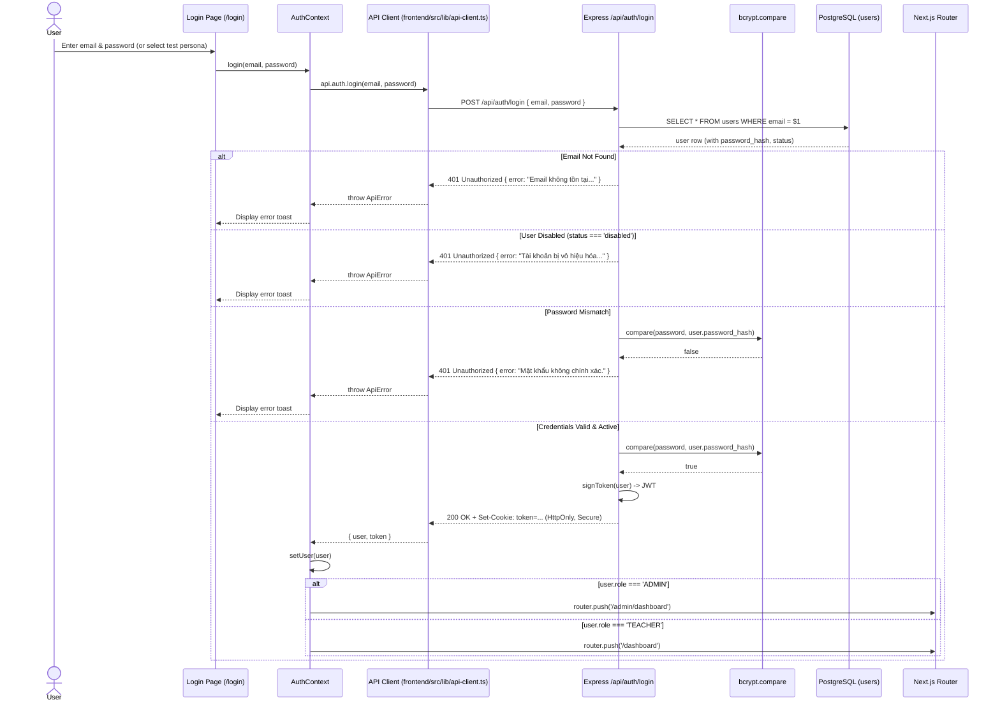

# Authentication Architecture

## 1. Authentication Mechanism

Authentication in SchoolOps is managed by the self-managed Express backend (`backend/src/services/auth.service.ts`) using secure password hashing with **bcrypt**, signed **JSON Web Tokens (JWT)**, and secure **HTTP-only cookies** (`token`) with Bearer token fallback.

---

## 2. Session Model & Storage

### 2.1. Backend Authentication Context
On each incoming authenticated request:
1. `authenticate` middleware (`backend/src/middleware/auth.middleware.ts`) extracts the token from the `token` cookie or `Authorization: Bearer <token>` header.
2. Verifies the cryptographic signature using `JWT_SECRET`.
3. Checks that the user exists and is not disabled (`status !== 'disabled'`).
4. Attaches `req.user = { id, email, name, role, status }` to Express `Request`.

### 2.2. Session Validation on Boot
When any protected page mounts:
1. `AuthProvider` triggers `refreshUser()`.
2. Calls `GET /api/auth/me` with cookie credentials.
3. If the token is expired, corrupted, or user account was disabled, access is rejected and client redirects to `/login`.

### 2.3. Logout Flow
Calling `logout()`:
1. Sends `POST /api/auth/logout` to the backend.
2. Backend responds with `clearCookie('token')`.
3. Client resets React state `user = null` and navigates to `/login`.

---

## 3. Pre-Configured Test Personas (1-Click Login)

The `/login` route exposes 6 pre-configured user scenarios designed to test distinct authorization and state handling paths:

| Persona | Name | Role | Email | Password | Intended Test Coverage |
| :--- | :--- | :---: | :--- | :--- | :--- |
| **System Administrator** | Admin Hệ thống | `ADMIN` | `admin@schoolops.local` | `admin` | Full school access, faculty assignments, master timetable. |
| **Dual Role (GVCN + GVBM)** | Thầy Nguyễn Văn An | `TEACHER` | `an.nguyen@schoolops.local` | `teacher1` | Tests dynamic role switching: GVCN in 6A1 (Toán), GVBM in 6A2, 7A1, 7A2. |
| **Pure Subject Teacher** | Thầy Hoàng Văn Cường | `TEACHER` | `cuong.hoang@schoolops.local` | `teacher23` | Pure GVBM (Công nghệ). Tests read-only rosters and subject attendance locking. |
| **Pure Homeroom Teacher**| Cô Nguyễn Thị Hương | `TEACHER` | `huong.nguyen@schoolops.local` | `teacher16` | Pure GVCN of 6A4 (no outside subject teaching). |
| **Unassigned Staff** | Thầy Đỗ Văn Tân | `TEACHER` | `unassigned@schoolops.local` | `unassigned` | Newly onboarded staff with 0 classes. Tests empty state banner. |
| **Disabled Account** | Thầy Vũ Đình Trọng | `TEACHER` | `disabled@schoolops.local` | `disabled` | Account marked `status = 'disabled'`. Tests login rejection. |

---

## 4. Route Protection Proxy (`frontend/src/proxy.ts`)

The Next.js 16 network layer proxy guards route navigation:
1. Inspects the incoming request for session token cookie.
2. Unauthenticated requests to protected paths (`/dashboard`, `/students`, `/timetable`, etc.) are held or handled by client layout guards.
3. Authenticated requests attempting to visit `/login` are automatically redirected to `/dashboard`.
