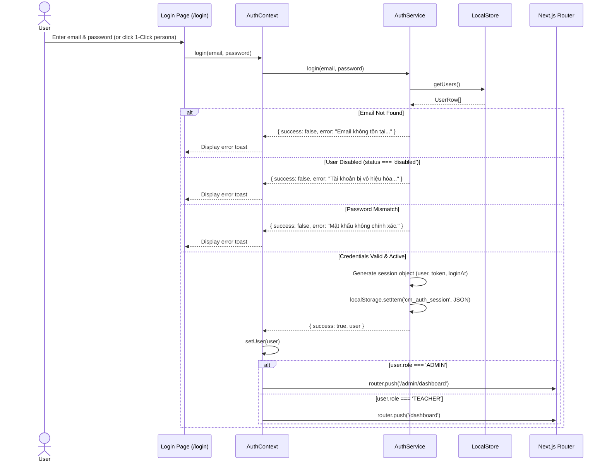

# Authentication Architecture

## 1. Authentication Mechanism

The application currently operates with a **Client-Side Tokenized Session Model** backed by `localStorage` and managed via `AuthService` (`src/lib/auth.ts`) and `AuthContext` (`src/contexts/auth-context.tsx`).

In addition, an Edge Middleware (`src/middleware.ts`) is pre-configured with `@supabase/ssr` to intercept requests, refresh session cookies, and protect routes as soon as live Supabase credentials are provided.



---

## 2. Session Model & Storage

### 2.1. Session Interface
The active session object stored under `localStorage` key `cm_auth_session`:

```typescript
export interface AuthSession {
  user: UserRow;
  token: string;       // Formatted as `mock-token-${user.id}-${timestamp}`
  loginAt: string;     // ISO 8601 string timestamp
}
```

### 2.2. Session Validation on Boot
When any protected page mounts:
1. `AuthProvider` triggers `refreshUser()`.
2. `AuthService.getCurrentUser()` reads `cm_auth_session`.
3. If a session exists, it cross-checks `LocalStore.getUserById(session.user.id)`.
4. If the user was disabled or removed, `AuthService.logout()` is called automatically, revoking access.

### 2.3. Logout Flow
Calling `logout()`:
- Clears `cm_auth_session` from `localStorage`.
- Clears `cm_active_class_id` from `localStorage`.
- Resets React state `user = null`.
- Navigates the client to `/login`.

---

## 3. Pre-Configured Test Personas (1-Click Login)

The `/login` route exposes 6 pre-configured user scenarios designed to test distinct authorization and state handling paths:

| Persona | Name | Role | Email | Password | Intended Test Coverage |
| :--- | :--- | :---: | :--- | :--- | :--- |
| **System Administrator** | Admin Hệ thống | `ADMIN` | `admin@classmanager.local` | `admin` | Full school access, faculty assignments, master timetable. |
| **Dual Role (GVCN + GVBM)** | Thầy Nguyễn Văn An | `TEACHER` | `an.nguyen@classmanager.local` | `teacher1` | Tests dynamic role switching: GVCN in 6A1 (Toán), GVBM in 6A2, 7A1, 7A2. |
| **Pure Subject Teacher** | Thầy Hoàng Văn Cường | `TEACHER` | `cuong.hoang@classmanager.local` | `teacher23` | Pure GVBM (Công nghệ). Tests read-only rosters and subject attendance locking. |
| **Pure Homeroom Teacher**| Cô Nguyễn Thị Hương | `TEACHER` | `huong.nguyen@classmanager.local` | `teacher16` | Pure GVCN of 6A4 (no outside subject teaching). |
| **Unassigned Staff** | Thầy Đỗ Văn Tân | `TEACHER` | `unassigned@classmanager.local` | `unassigned` | Newly onboarded staff with 0 classes. Tests empty state banner. |
| **Disabled Account** | Thầy Vũ Đình Trọng | `TEACHER` | `disabled@classmanager.local` | `disabled` | Account marked `status = 'disabled'`. Tests login rejection. |

---

## 4. Supabase SSR Middleware Integration Roadmap

The application includes an Edge Middleware at `src/middleware.ts`. When connected to Supabase:
1. Every incoming HTTP request passes through `createServerClient`.
2. Supabase reads auth cookies via `request.cookies.getAll()`.
3. Calls `supabase.auth.getUser()`.
4. If unauthenticated, redirects to `/login`.
5. If authenticated and attempting to visit `/login`, redirects to `/dashboard`.
