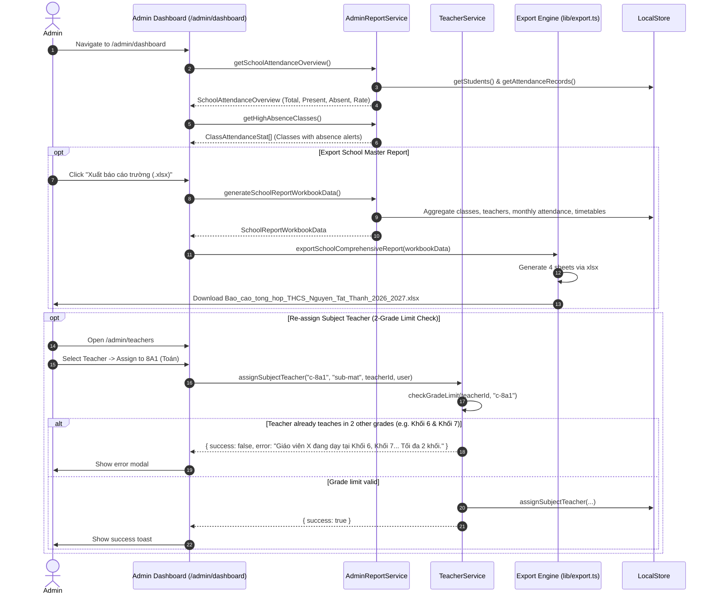

# Workflow: Administration Governance & School-Wide Reporting

## 1. Flow Overview

This workflow documents school governance activities carried out by Administrators, including school-wide attendance monitoring, high-absence alerts, faculty management, and 4-sheet master Excel workbook export.

---

## 2. Executive Dashboard Components

### 2.1. School-Wide Attendance KPIs
* **Today's Attendance Rate:** e.g., `468/480 học sinh · 97.5%`, accompanied by a progress bar.
* **Status Badges:** Present count, Unexcused Absence count, Excused Absence count, and Tardy count.
* **Grade-Level Breakdown:** Separate compliance cards for Khối 6, Khối 7, Khối 8, and Khối 9.

### 2.2. High Absence Alert Feed
Automatically scans all 16 classes. If any class has 2 or more absent students today, it surfaces in an amber/rose alert feed with direct action links to view the class's attendance sheet.

### 2.3. Filterable 16-Class Real-Time Table
Displays all 16 classes with columns:
- Class Name (e.g., 6A1)
- Grade (6–9)
- Homeroom Teacher (GVCN)
- Room Name (Phòng học)
- Attendance Rate Today
- Present / Absent / Late breakdown
- Action button to view roster or attendance

### 2.4. School-Wide Attendance Reset Tool (Đặt lại điểm danh về Có mặt)
Under the **Default-Present Attendance** paradigm, when a new day arrives, all 480 students across 16 classes are automatically regarded as 100% Present with no manual action needed.
Administrators are equipped with an emergency and reconciliation tool:
- **Button:** Located in both the Executive Header and the Grade-Level Attendance section.
- **Confirmation Modal:** Allows specifying date and target scope (Whole school or specific class).
- **Functionality:** Wipes out all mistaken absence/tardy records and restores the cohort to 100% Present immediately.

### 2.5. Dedicated Attendance Management Portal (`/admin/attendance`)
To separate school-level executive governance from individual subject rolls, a dedicated **Quản lý Chuyên cần** tab is permanently pinned to the Admin Sidebar:
- **School-Wide KPI Deck:** Live attendance rate (%), present tally, excused/unexcused absences, and tardy counts.
- **4-Grade Cohort Breakdown:** Visual breakdown of Khối 6 & 9 (Morning Shift) and Khối 7 & 8 (Afternoon Shift).
- **16-Class Granular Table:** Real-time roster counts, present/absent/late counts, compliance rates, single-class reset actions, and class detail modals.
- **School-Wide Daily Exceptions Register:** Comprehensive roster of every student absent or late today across all 16 classes, including reasons/notes.
- **Integrated Reset Tool:** Central hub for executing whole-school or per-class attendance resets.

### 2.6. Dedicated Student Management Portal (`/admin/students` & `/admin/students/[id]`)
To enforce strict data integrity and authoritative record keeping, **all student roster mutations (create, edit, delete, import, class transfer) are restricted exclusively to Administrators**:
- **Authoritative Central Control:** Teachers (both Homeroom GVCN and Subject GVBM) have read-only access to view student profiles and seat positions, eliminating accidental edits or unauthorized changes.
- **Dedicated Admin Routes:** 
  - List & Batch Management: `/admin/students`
  - Individual Student Profile & Direct Management: `/admin/students/[id]` (separate from the User/Teacher `/students/[id]` view, maintaining Admin layout and direct back navigation).
- **Default Grade & Class Ordering with On-Demand A-Z Sorting:** The registry defaults to strict pedagogical ordering by Grade (Khối 6 -> 7 -> 8 -> 9) and class section, with fast dropdown sorting for Vietnamese Alphabetical A-Z (`compareVietnameseNames`), Z-A, Student Code, and Age.
- **School-Wide 480-Student Registry:** Filterable by grade (Khối 6, 7, 8, 9), class (16 classes), gender, and status.
- **Student CRUD & Detail Modals:** Admin interface for adding, modifying personal info, reassigning classes, and logging administrative notes.
- **Class Transfer Capability:** Admin can easily reassign students between classes while strictly enforcing the 30-student class capacity.
- **Bulk Excel/CSV Import:** Batch enrollment tool with pre-flight file validation and error reporting.
- **Single-Click Export:** Export filtered or whole-school student registries to Excel with Vietnamese font support.
- **Workspace Separation:** Clear demarcation between **Admin Portal** (Giao diện Quản trị) and **User Portal** (Giao diện Người dùng / Giáo viên) in navigation sidebars.

### 2.7. Admin Seating Management Portal (`/admin/seating`)
Administrators have comprehensive oversight and management rights over classroom seating arrangements across all 16 THCS classes:
- **Full 16-Class Selection:** Quick-switch tabs for Grades 6, 7, 8, 9 with direct access to any class roster without leaving the Admin Portal.
- **Interactive 16-Desk Matrix (32 Seats):** 4 columns x 4 rows visual grid, clearly indicating front of classroom, podium, teacher's desk, and entrance door.
- **Seat Mutation & Reassignment:** Two-click seat swapping, empty-seat assignment for unseated students, and single-click removal.
- **Automated Seating Algorithms:** Smart Fisher-Yates randomization and alternating male-female seating arrangement.
- **Attendance Overlay Integration:** Toggle real-time visualization of today's attendance directly on the desks (highlighting absent and late students).
- **Dual Perspective:** Switch between "Looking from Back of Class to Board" and "Looking from Podium to Class".
- **Print & PDF Export:** One-click clean print layout for physical classroom posting.

### 2.8. Admin School-Wide Announcements Portal (`/admin/announcements`)
As the central school authority, Administrators issue directives, official schedules, and school-wide announcements:
- **Scope-Targeted Broadcasts:** Issue announcements to all 16 classes (entire school · 480 students & 24 teachers) or target specific grades/classes.
- **High-Priority Pinning:** Pin crucial circulars (exam schedules, holidays, emergency alerts) to the top of noticeboards.
- **Full Life-Cycle Management:** Create, filter by scope, unpin, and delete announcements.

---

## 3. Comprehensive Master Excel Workbook (4 Sheets)

The export engine (`exportSchoolComprehensiveReport`) packages the entire school's data into a 4-sheet workbook:

| Sheet Name | Content | Columns |
| :--- | :--- | :--- |
| **`16 Lớp học`** | Directory of all classes | STT, Mã lớp, Tên lớp, Khối, Phòng học, GVCN, Sĩ số hiện tại, Sĩ số tối đa, Số bàn học, Trạng thái |
| **`Đội ngũ Giáo viên`** | Directory of all 24 teachers | STT, Họ và tên, Email, Số điện thoại, Vai trò, Trạng thái, Lớp chủ nhiệm, Phân công giảng dạy |
| **`Chuyên cần toàn trường`** | Monthly attendance rollup for 16 classes | STT, Tên lớp, Khối, Sĩ số, Lượt có mặt, Vắng không phép, Vắng có phép, Đi muộn, Tổng lượt, Tỷ lệ chuyên cần |
| **`Thời khóa biểu`** | Master schedule of all 16 classes (448 slots) | STT, Lớp học, Khối, Thứ, Tiết học, Khung giờ, Môn học, Giáo viên giảng dạy |
