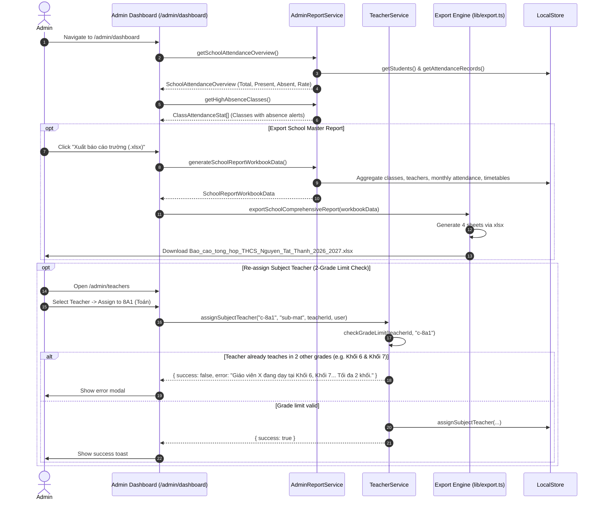

# Workflow: Administration Governance & School-Wide Reporting

## 1. Flow Overview

This workflow documents school governance activities carried out by Administrators, including school-wide attendance monitoring, high-absence alerts, faculty management, and 4-sheet master Excel workbook export.

---

## 2. Executive Dashboard Components

### 2.1. School-Wide Attendance KPIs
* **Today's Attendance Rate:** e.g., `468/480 học sinh · 97.5%`, accompanied by a progress bar.
* **Status Badges:** Present count, Unexcused Absence count, Excused Absence count, and Tardy count.
* **Grade-Level Breakdown:** Separate compliance cards for Khối 6, Khối 7, Khối 8, and Khối 9.

### 2.2. High Absence Alert Feed
Automatically scans all 16 classes. If any class has 2 or more absent students today, it surfaces in an amber/rose alert feed with direct action links to view the class's attendance sheet.

### 2.3. Filterable 16-Class Real-Time Table
Displays all 16 classes with columns:
- Class Name (e.g., 6A1)
- Grade (6–9)
- Homeroom Teacher (GVCN)
- Room Name (Phòng học)
- Attendance Rate Today
- Present / Absent / Late breakdown
- Action button to view roster or attendance

---

## 3. Comprehensive Master Excel Workbook (4 Sheets)

The export engine (`exportSchoolComprehensiveReport`) packages the entire school's data into a 4-sheet workbook:

| Sheet Name | Content | Columns |
| :--- | :--- | :--- |
| **`16 Lớp học`** | Directory of all classes | STT, Mã lớp, Tên lớp, Khối, Phòng học, GVCN, Sĩ số hiện tại, Sĩ số tối đa, Số bàn học, Trạng thái |
| **`Đội ngũ Giáo viên`** | Directory of all 24 teachers | STT, Họ và tên, Email, Số điện thoại, Vai trò, Trạng thái, Lớp chủ nhiệm, Phân công giảng dạy |
| **`Chuyên cần toàn trường`** | Monthly attendance rollup for 16 classes | STT, Tên lớp, Khối, Sĩ số, Lượt có mặt, Vắng không phép, Vắng có phép, Đi muộn, Tổng lượt, Tỷ lệ chuyên cần |
| **`Thời khóa biểu`** | Master schedule of all 16 classes (448 slots) | STT, Lớp học, Khối, Thứ, Tiết học, Khung giờ, Môn học, Giáo viên giảng dạy |
