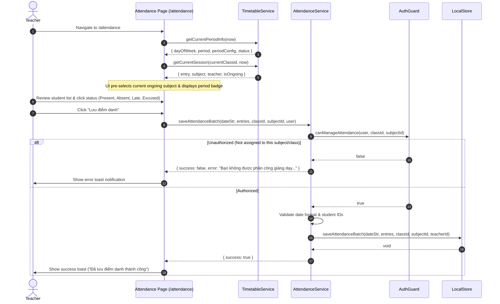

# Workflow: Attendance Management & Real-Time Context

## 1. Flow Overview

This workflow details how the attendance interface identifies ongoing timetable sessions, validates teacher permissions, records attendance batches, and exposes quick administrative copy actions.



---

## 2. Key Pedagogical Features

### 2.1. Smart Period Resolution
When the teacher opens `/attendance`, the system reads the device time:
- Matches current hours against `TIMETABLE_PERIODS` (e.g., 07:15–08:00 = Tiết 1).
- Queries `LocalStore.getTimetable(classId)` for the current day and period.
- Automatically selects the scheduled subject in the dropdown.
- Displays a banner:
  - If teacher is assigned: *"Đang điểm danh đúng môn học hiện tại: Môn [Tên môn]"*.
  - If teacher is different: *"Tiết học hiện tại là môn [Môn khác]. Chuyển nhanh sang môn này?"*.

### 2.2. Quick Tab Filters
Teachers can filter the 30–40 students on screen with 1 click:
- `Tất cả`: Complete roster.
- `Chưa có mặt`: Shows only students marked `absent` or `late`.
- `Có mặt`: Present students.
- `Vắng`: Absent students.
- `Muộn`: Tardy students.
- `Có phép`: Excused absence students.

### 2.3. Copy Absence Report for School Leadership (BGH)
Clicking **"Sao chép báo cáo BGH"** generates a pre-formatted Vietnamese text report copied to the clipboard:
```text
BÁO CÁO CHUYÊN CẦN ĐẦU GIỜ
Trường THCS Nguyễn Tất Thành
Lớp: 6A1 — Ngày: 23/09/2026
Sĩ số: 30 | Có mặt: 28 | Vắng: 2 (1 có phép, 1 không phép) | Muộn: 0
Danh sách học sinh vắng:
1. Nguyễn Văn B (Vắng không phép)
2. Trần Thị C (Nghỉ phép)
GVCN: Thầy Nguyễn Văn An
```
Teachers paste this directly into their grade-level Zalo group or school SMS portal.

### 2.4. Default-Present Architecture (Attendance-by-Exception)
In modern secondary school management, the overwhelming majority of students attend school regularly (>98%). Requiring teachers or administrators to click an initialization button every morning creates redundant friction.

The system employs **Default-Present Attendance (Điểm danh theo ngoại lệ)**:
1. **Automatic Full Attendance:** At the start of every new day, all 480 active students across all 16 classes are automatically regarded as `present` (Có mặt). School-wide and class-level attendance rates start at 100%.
2. **Exception-Only Updates:** Teachers only interact with the roster when an exception occurs — marking students who are `absent` (vắng), `late` (đi muộn), or `excused` (nghỉ phép).
3. **Real-time Analytics:** `AdminReportService` derives attendance metrics dynamically: active students minus exceptions = present students.

### 2.5. Admin Reset Attendance Tool
To guard against erroneous batch submissions or accidental overrides:
- **Scope:** Whole school (all 16 classes, 480 students) or a specific targeted class.
- **Access Control:** Restricted strictly to `ADMIN` (and Homeroom Teachers for their own class).
- **Execution:** Clears all absence/tardy exception records for the selected date and restores all students to 100% Present.
- **Auditing:** Accessible via the Executive Action bar and the Grade Attendance feed on the Admin Dashboard (`/admin/dashboard`).

### 2.6. Grade-Level Attendance Breakdown Report (Báo cáo Phân rã theo 4 Khối Lớp)
In the administrative attendance reporting center (`/admin/attendance`), when administrators generate or print the official daily attendance report for School Leadership (BGH):
- **4 Dedicated Grade Breakdown Tables:** System generates four itemized tables corresponding to **Khối 6, Khối 7, Khối 8, and Khối 9**.
- **Detailed Class Roster:** Each table lists all classes in that grade with metrics: Total Enrollment (Sĩ số), Present (Có mặt), Excused Absences (Có phép), Unexcused Absences (Không phép), Tardy (Muộn), and exact names of absent/tardy students.
- **Grade Totals & A4 Print Formatting:** Includes subtotal summary rows per grade and standard ministry print header/footer signatures for official archiving.
