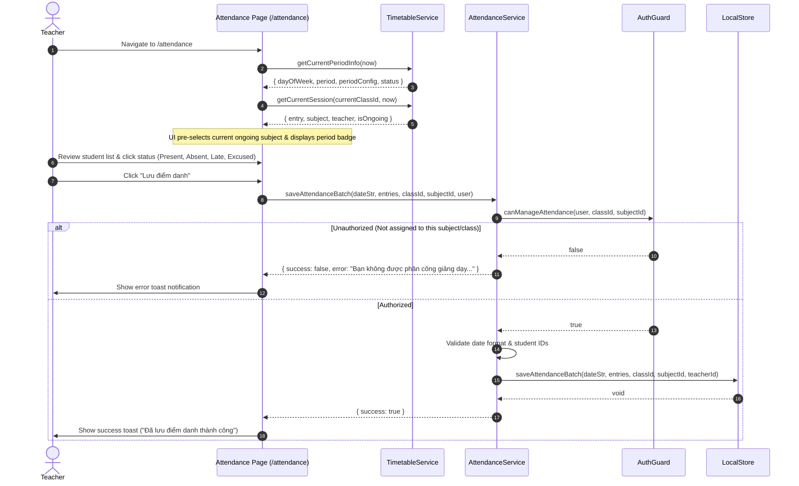

# Workflow: Attendance Management & Real-Time Context

## 1. Flow Overview

This workflow details how the attendance interface identifies ongoing timetable sessions, validates teacher permissions, records attendance batches, and exposes quick administrative copy actions.



---

## 2. Key Pedagogical Features

### 2.1. Smart Period Resolution
When the teacher opens `/attendance`, the system reads the device time:
- Matches current hours against `TIMETABLE_PERIODS` (e.g., 07:15–08:00 = Tiết 1).
- Queries `LocalStore.getTimetable(classId)` for the current day and period.
- Automatically selects the scheduled subject in the dropdown.
- Displays a banner:
  - If teacher is assigned: *"Đang điểm danh đúng môn học hiện tại: Môn [Tên môn]"*.
  - If teacher is different: *"Tiết học hiện tại là môn [Môn khác]. Chuyển nhanh sang môn này?"*.

### 2.2. Quick Tab Filters
Teachers can filter the 30–40 students on screen with 1 click:
- `Tất cả`: Complete roster.
- `Chưa có mặt`: Shows only students marked `absent` or `late`.
- `Có mặt`: Present students.
- `Vắng`: Absent students.
- `Muộn`: Tardy students.
- `Có phép`: Excused absence students.

### 2.3. Copy Absence Report for School Leadership (BGH)
Clicking **"Sao chép báo cáo BGH"** generates a pre-formatted Vietnamese text report copied to the clipboard:
```text
BÁO CÁO CHUYÊN CẦN ĐẦU GIỜ
Trường THCS Nguyễn Tất Thành
Lớp: 6A1 — Ngày: 23/09/2026
Sĩ số: 30 | Có mặt: 28 | Vắng: 2 (1 có phép, 1 không phép) | Muộn: 0
Danh sách học sinh vắng:
1. Nguyễn Văn B (Vắng không phép)
2. Trần Thị C (Nghỉ phép)
GVCN: Thầy Nguyễn Văn An
```
Teachers paste this directly into their grade-level Zalo group or school SMS portal.
