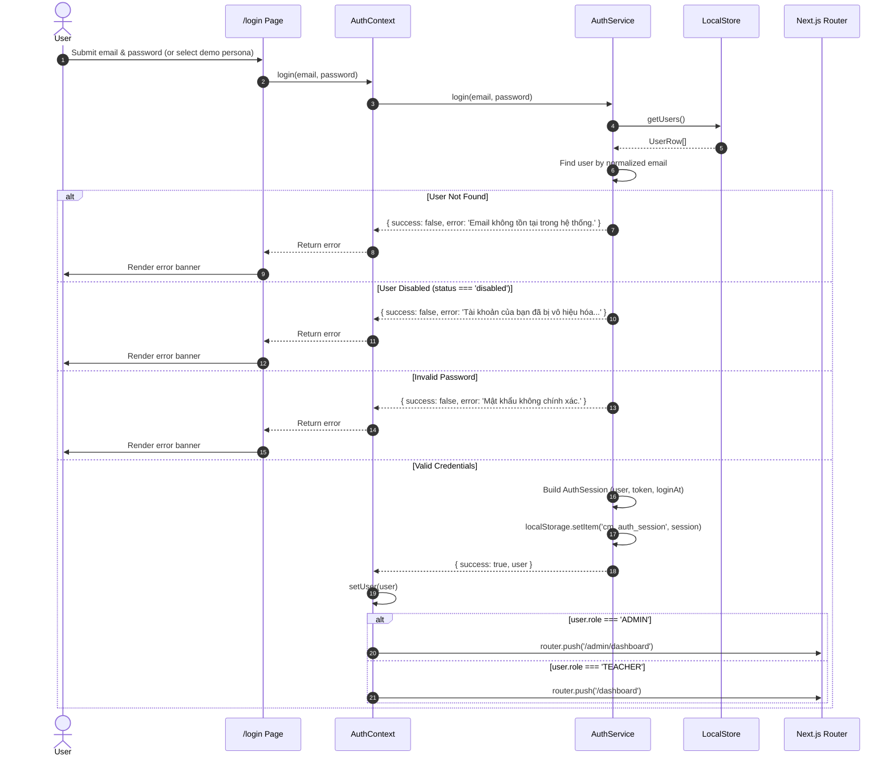

# Workflow: User Authentication & Route Guarding

## 1. Flow Overview

This workflow covers user login, credential verification, session creation, account status checks, and role-based redirect to the appropriate portal.

---

## 2. Step-by-Step Execution

1. **User Action:** The user visits `/login`. If already authenticated, the page's `useEffect` immediately redirects the user to `/admin/dashboard` or `/dashboard`.
2. **Form Submission:** The user fills the credentials or selects a 1-Click persona (Admin, Thầy Nguyễn Văn An, Thầy Hoàng Văn Cường, Cô Nguyễn Thị Hương, Thầy Đỗ Văn Tân, or Thầy Vũ Đình Trọng).
3. **Verification:**
   - Case-insensitive email trim.
   - Status verification: Rejects accounts with `status = 'disabled'`.
   - Password match check.
4. **Session Token Generation:** Generates a synthetic token `mock-token-${user.id}-${Date.now()}` and saves to `cm_auth_session`.
5. **Post-Login Routing:**
   - Administrators are sent to `/admin/dashboard`.
   - Teachers are sent to `/dashboard`.
6. **Class Bootstrap:** Once on `/dashboard`, `ClassContext` loads the teacher's assigned classes from `LocalStore`. If the teacher has no assigned classes, an informational "Unassigned Teacher" screen is displayed.
