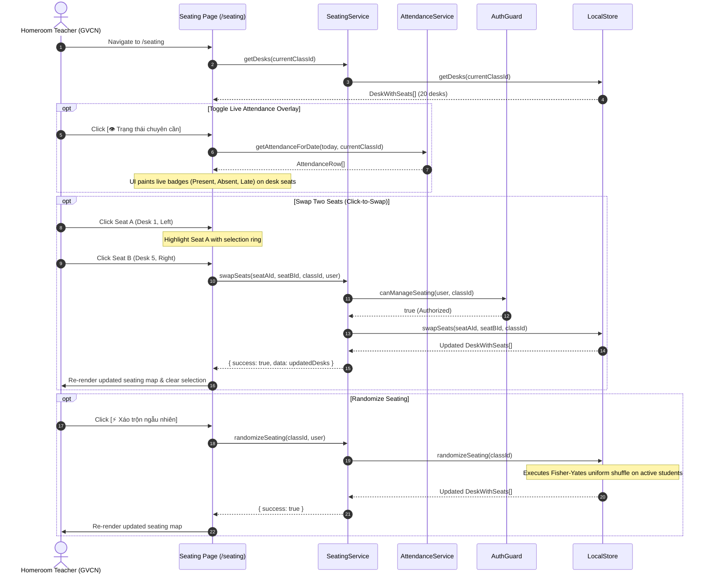

# Workflow: Seating Chart & Classroom Arrangements

## 1. Flow Overview

This workflow documents how the classroom layout (4 columns × 5 rows = 20 double desks = 40 seats) is rendered, manipulated via Click-to-Swap or Fisher-Yates shuffle, overlaid with live attendance statuses, and exported for physical classroom printing.



---

## 2. Classroom Geometry & Dual Perspective

### 2.1. Physical Layout Matrix
The classroom is standardized as a grid:
* **Columns:** 4 vertical aisles/columns (`col_num` 1..4).
* **Rows:** 5 horizontal rows (`row_num` 1..5).
* **Desks:** 20 desks total (`desk_number` 1..20).
* **Seats:** Each desk has 2 seats: `left` (bên trái) and `right` (bên phải). Total seats: 40.

### 2.2. Dual Perspective Modes
Teachers can view the classroom from two viewpoints, toggled via a button and stored in `localStorage` key `cm_seating_perspective`:
1. **Nhìn từ cuối lớp (View from Back):** Default perspective. Row 1 is closest to the podium at the top; Row 5 is at the bottom.
2. **Nhìn từ bục giảng (View from Teacher's Podium):** Rotates the grid so the perspective mirrors the teacher looking out at the students (Row 1 is closest at the bottom, left and right sides match teacher's visual field).

---

## 3. Live Attendance Overlay

When active, seats show color-coded badges matching the student's status today:
* **`✓ Có mặt`:** Emerald badge, clean border.
* **`✕ Vắng`:** Rose badge, highlighted border with subtle pulsing animation to draw immediate attention to empty seats.
* **`⏱ Muộn`:** Amber badge, amber border.
* **`📋 Phép`:** Slate neutral badge.

---

## 4. Official Landscape A4 Print Export

Clicking **"In sơ đồ"** invokes `window.print()` with dedicated `@media print` styles:
- Automatically sets page orientation to landscape: `@page { size: landscape; margin: 8mm; }`.
- Hides sidebars, navigation headers, action buttons, and filters.
- Adds an official school header:
  ```text
  TRƯỜNG THCS NGUYỄN TẤT THÀNH
  SƠ ĐỒ VỊ TRÍ CHỖ NGỒI HỌC SINH — LỚP 6A1
  Năm học: 2026 - 2027
  ```
- Renders the 20 desks clearly with student codes and full names.
- Adds official signature blocks at the bottom:
  ```text
  XÁC NHẬN CỦA BAN GIÁM HIỆU              GIÁO VIÊN CHỦ NHIỆM
         (Ký và ghi rõ họ tên)                      (Ký và ghi rõ họ tên)
  ```
