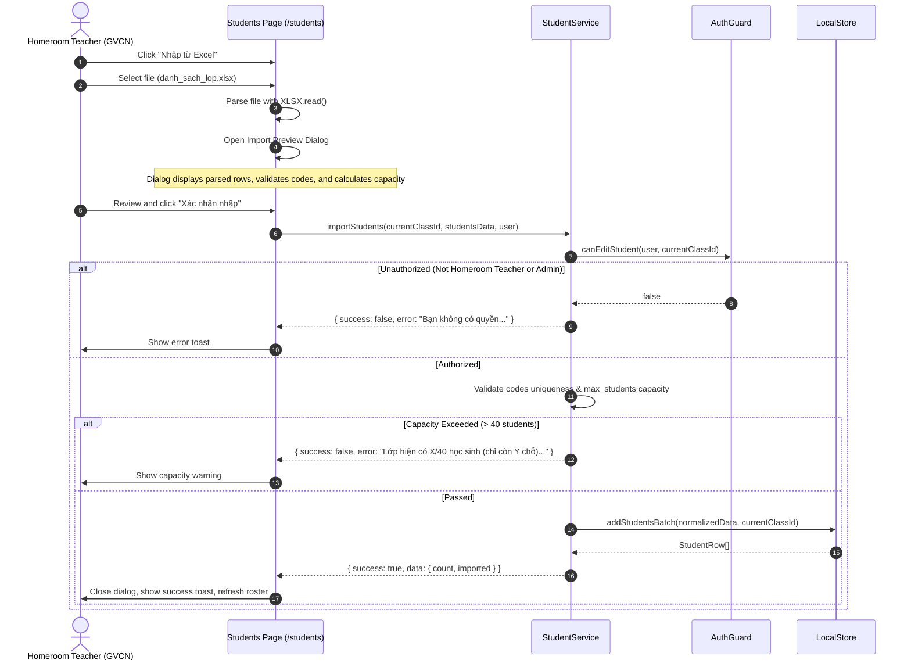

# Workflow: Student Roster Management & Bulk Excel Import

## 1. Flow Overview

This workflow documents student enrollment, single-student CRUD, bulk Excel/CSV roster import with pre-validation, roster filtering, and student profile navigation.



---

## 2. Bulk Excel Import Engine

### 2.1. File Acceptance
Accepts `.xlsx`, `.xls`, and `.csv` files. The user can download the standard template `mau_danh_sach_hoc_sinh.xlsx` with pre-defined headers:
* `STT` (Ordinal number)
* `Mã học sinh (*)` (Required, e.g., `HS41`, `6A1-05`)
* `Họ và tên (*)` (Required, Vietnamese Unicode text)
* `Giới tính` (`Nam` / `Nữ`)
* `Ngày sinh` (`YYYY-MM-DD` or Excel date serial)
* `SĐT phụ huynh`
* `Email`

### 2.2. Pre-Import Validation Checks
Before submitting data, the client-side parser checks:
1. **Duplicate within File:** Ensures the same student code does not appear twice in the uploaded spreadsheet.
2. **Duplicate in Existing Class:** Cross-checks against `LocalStore.getStudents(classId)`.
3. **Capacity Threshold:**
   ```typescript
   const activeCount = currentStudents.filter((s) => s.status === 'active').length;
   const maxAllowed = targetClass.max_students || 40;
   if (activeCount + studentsData.length > maxAllowed) {
     return failure(`Không thể nhập ${studentsData.length} học sinh. Lớp hiện có ${activeCount}/${maxAllowed}...`);
   }
   ```

---

## 3. Student Profile & Parent Contact Center (`/students/[id]`)

Navigating to a student's profile opens a card-based workspace:
* **Academic Overview:** Student code, class name, date of birth, gender, enrollment status.
* **Seating Status:** Desk number and desk side (Trái / Phải), with a direct link to the desk on `/seating`.
* **Attendance Summary:** Historical rate (e.g., 95%), total present sessions, unexcused absences, and late sessions.
* **Parent Contact Center:**
  - One-touch phone call: `<a href="tel:0912345678">`.
  - One-touch SMS: `<a href="sms:0912345678">`.
  - One-touch Zalo Chat: `<a href="https://zalo.me/0912345678">`.
  - **1-Click Notice Generator:** Generates pre-formatted templates for parents:
    - *Thông báo vắng mặt không phép hôm nay*
    - *Nhắc nhở học sinh đi muộn*
    - *Báo cáo chuyên cần định kỳ tháng*
    - *Giấy mời phụ huynh trao đổi với GVCN*
* **Pedagogical Remarks (Sổ ghi chú):** Allows GVCN to add date-stamped notes regarding student discipline, learning progress, or health updates.
