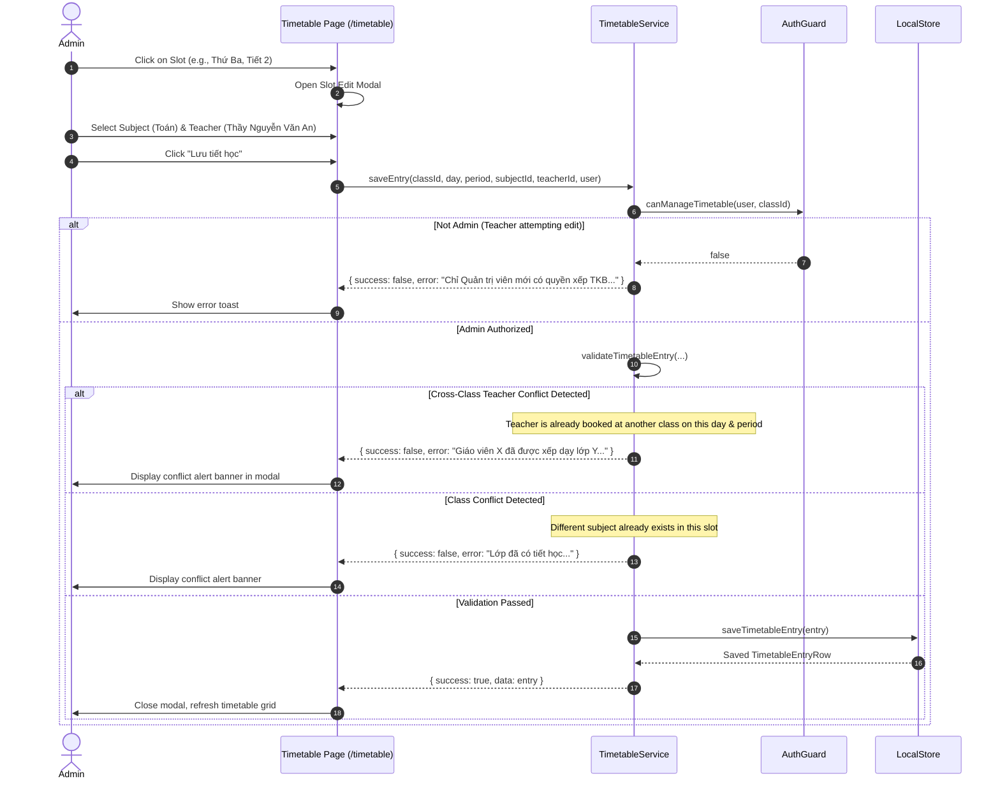

# Workflow: Timetable Schedule & Conflict Prevention Engine

## 1. Flow Overview

This workflow documents how secondary school weekly schedules (6 days × 5 periods = 30 slots per week) are created, updated, copied, and protected against cross-class teacher double-booking.



---

## 2. Shift Model & Schedule Constraints

### 2.1. Dual-Shift Schedule (Khối Sáng & Khối Chiều)
Secondary schools operate on two shifts:
* **Khối 6 & Khối 9 (Buổi Sáng):**
  - Thứ Hai – Thứ Sáu: Tiết 1–5 (07:15 – 11:15).
  - Thứ Bảy: Tiết 1–3 (07:15 – 09:40). **Tiết 3 bắt buộc là Sinh hoạt lớp** do GVCN phụ trách.
* **Khối 7 & Khối 8 (Buổi Chiều):**
  - Thứ Hai – Thứ Sáu: Tiết 6–10 (13:00 – 17:00).
  - Thứ Bảy: Tiết 6–8 (13:00 – 15:25). **Tiết 8 bắt buộc là Sinh hoạt lớp** do GVCN phụ trách.
* **Prohibited Slots:**
  - Tiết 4 & 5 Thứ Bảy sáng do không tổ chức học.
  - Tiết 9 & 10 Thứ Bảy chiều do không tổ chức học.
  - Morning classes cannot have afternoon periods (6–10); afternoon classes cannot have morning periods (1–5).

---

## 3. Conflict Prevention Engine (`TimetableService`)

Before writing any slot, two validation passes execute:

### 3.1. `checkClassConflict`
Checks if the target class already has an existing timetable entry occupying the same `(day_of_week, period)`. If updating an existing entry, `excludeEntryId` ensures the entry does not conflict with itself.

### 3.2. `checkTeacherConflict`
Scans all 16 classes in the school:
```typescript
const all = LocalStore.getAllTimetables();
const conflict = all.find(
  (t) =>
    t.teacher_id === teacherId &&
    t.day_of_week === dayOfWeek &&
    t.period === period &&
    (excludeEntryId ? t.id !== excludeEntryId : true) &&
    (targetClassId ? t.class_id !== targetClassId : true)
);
```
If a record matches, the save is rejected and a detailed message is returned:
*"Không thể xếp tiết học này. Giáo viên [Tên] đã được xếp dạy lớp [Tên lớp] (môn [Môn]) vào [Thứ], [Tiết]."*

---

## 4. Bulk Operations

* **Áp dụng Mẫu Chuẩn (Standard 28-Period Template):**
  Fills all 28 weekly slots with the Ministry curriculum distribution (4 Toán, 4 Ngữ văn, 3 Tiếng Anh, 2 Vật lý, 2 Hóa học, 2 Sinh học, 2 Lịch sử, 2 Địa lý, 2 Tin học, 2 Công nghệ, 1 Sinh hoạt lớp).
* **Sao chép Thời khóa biểu (Class-to-Class Copy):**
  Copies schedule from a source class to a target class.
  - Runs in an **atomic transaction**: validates all 28 slots first. If any slot introduces a teacher conflict with existing classes, the entire operation is rolled back with an itemized conflict report.
  - Automatically re-binds Saturday Homeroom period to the target class's designated GVCN.
