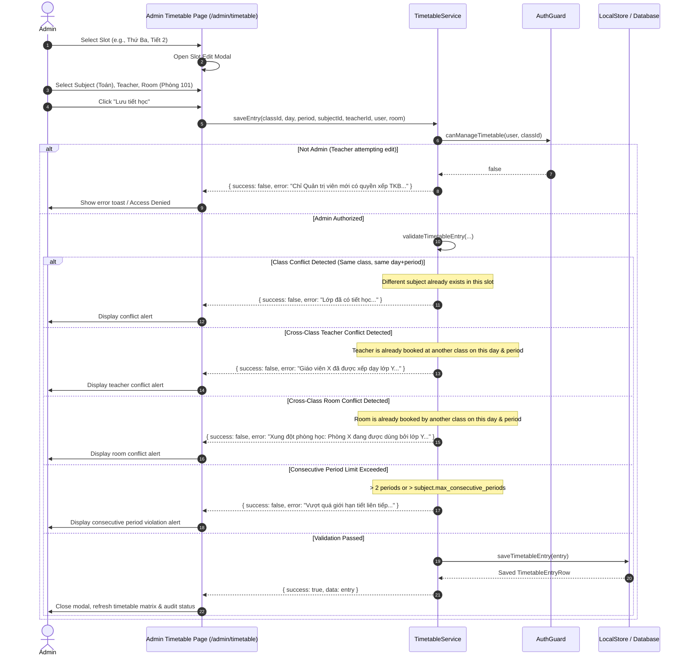

# Workflow: Timetable Schedule & Conflict Prevention Engine

## 1. Flow Overview

This workflow documents how secondary school weekly schedules (6 days × 5 periods = 30 slots per week) are created, updated, reorganized, audited, and protected against cross-class teacher double-booking, room conflicts, and consecutive period rule violations.

---

## 2. Shift Model & Schedule Constraints

### 2.1. Dual-Shift Schedule (Khối Sáng & Khối Chiều)
Secondary schools operate on two shifts:
* **Khối 6 & Khối 9 (Buổi Sáng):**
  - Thứ Hai – Thứ Sáu: Tiết 1–5 (07:15 – 11:15).
  - Thứ Bảy: Tiết 1–3 (07:15 – 09:40). **Tiết 3 bắt buộc là Sinh hoạt lớp** do GVCN phụ trách.
* **Khối 7 & Khối 8 (Buổi Chiều):**
  - Thứ Hai – Thứ Sáu: Tiết 6–10 (13:00 – 17:00).
  - Thứ Bảy: Tiết 6–8 (13:00 – 15:25). **Tiết 8 bắt buộc là Sinh hoạt lớp** do GVCN phụ trách.
* **Prohibited Slots:**
  - Tiết 4 & 5 Thứ Bảy sáng do không tổ chức học.
  - Tiết 9 & 10 Thứ Bảy chiều do không tổ chức học.
  - Morning classes cannot have afternoon periods (6–10); afternoon classes cannot have morning periods (1–5).

---

## 3. Conflict Prevention & Rule Engine (`TimetableService`)

Before writing any slot, multiple validation layers execute:

### 3.1. `checkClassConflict`
Checks if the target class already has an existing timetable entry occupying the same `(day_of_week, period)`. If updating an existing entry, `excludeEntryId` ensures the entry does not conflict with itself.

### 3.2. `checkTeacherConflict`
Scans all classes across the school to prevent teacher double-booking at `(day_of_week, period)`.
If a record matches, the save is rejected:
*"Không thể xếp tiết học này. Giáo viên [Tên] đã được xếp dạy lớp [Tên lớp] vào [Thứ], [Tiết]."*

### 3.3. `checkRoomConflict`
If a room is assigned to the entry (or inherited from `class.room_name`), verifies that no other class is scheduled in the same room on the same day and period.
If occupied:
*"Xung đột phòng học: Phòng [Phòng] đang được xếp cho lớp [Tên lớp] vào [Thứ], [Tiết]."*

### 3.4. `checkConsecutivePeriods`
Enforces pedagogical consecutive-period business rules:
1. **Global Maximum:** Under no condition may any subject be scheduled for **more than 2 consecutive periods** (Periods 1+2+3 is rejected).
2. **Subject-Specific Configuration:**
   - **Mathematics (`sub-mat`):** Configured with `max_consecutive_periods = 2` (Allows double periods).
   - **Literature (`sub-lit`):** Configured with `max_consecutive_periods = 2` (Allows double periods).
   - **Other Subjects:** Configured with `max_consecutive_periods = 1` (Allows single periods only; consecutive periods rejected).
   - Configurable dynamically via `subjects.max_consecutive_periods` without hardcoded subject names.

---

## 4. Timetable Audit & Diagnostics (`auditTimetable`)

Administrators can trigger automated audits across the entire school (`school` scope) or for a selected class (`class` scope).
The audit analyzes:
1. **Class Conflicts:** Duplicated slots within the same class.
2. **Teacher Conflicts:** Teachers assigned to multiple classes simultaneously.
3. **Room Conflicts:** Rooms assigned to multiple classes simultaneously.
4. **Consecutive Period Violations:** Any subject exceeding its configured `max_consecutive_periods` or exceeding the global maximum of 2 consecutive periods.

The audit produces an actionable diagnostic report with itemized violation messages, period sequences, and resolution options. In the UI, offending timetable cells are rendered with prominent red borders, warning badges, and an in-view alert banner.

---

## 5. Bulk Operations

* **Áp dụng Mẫu Chuẩn (Standard 28-Period Template):**
  Fills all 28 weekly slots with the Ministry curriculum distribution (4 Toán, 4 Ngữ văn, 3 Tiếng Anh, 2 Vật lý, 2 Hóa học, 2 Sinh học, 2 Lịch sử, 2 Địa lý, 2 Tin học, 2 Công nghệ, 1 Sinh hoạt lớp).
* **Sao chép Thời khóa biểu (Class-to-Class Copy):**
  Copies schedule from a source class to a target class.
  - Runs in an **atomic transaction**: validates all slots first. If any slot introduces a teacher/room conflict or consecutive period violation, the entire operation is rolled back with an itemized conflict report.
  - Automatically re-binds Saturday Homeroom period to the target class's designated GVCN.
* **Hoán đổi / Di chuyển Tiết học (Reorganize Slot):**
  Allows administrators to move a subject slot to an empty target period or swap two existing slots, performing full conflict and consecutive period checks on the resulting schedule before saving.

---

## 6. Access Control, Admin Edit Mode & Intelligent Filters

### 6.1. Dedicated Admin Edit Mode ("Sửa TKB")
To prevent unintended modifications during timetable inspection and review:
1. **Default Read-Only State:** Navigating to `/admin/timetable` defaults to a read-only presentation. Add buttons (`+ Thêm`), hover actions (Pencil, Trash, Swap), Template generation, and Clear Timetable actions are disabled and concealed.
2. **Explicit Activation:** Modifications require administrators to explicitly toggle **"Sửa TKB"**. The button shifts to a persistent active state with an informational top banner alert.
3. **User Portal Lockdown:** In the teacher/user portal (`/timetable`), editing permissions are completely locked (`canEdit = false`), and the "Sao chép TKB" tool is removed. All schedule structuring is centralized strictly under administrative authority.

### 6.2. Smart Class & Teacher Filter Synergy
1. **School-Wide Default State:**
   - Under "Tất cả giáo viên", the "Tất cả các lớp" aggregate option is omitted; the dropdown defaults to `-- Chọn lớp học --`.
   - The matrix renders blank until an intentional class or teacher filter is applied.
   - Clicking **"Đặt lại lọc"** restores this clean initial state.
2. **Teacher-Specific Mode:**
   - Selecting any specific teacher automatically transitions the class selector to `-- Tất cả các lớp (X lớp của GV) --` and hides the generic `-- Chọn lớp học --`.
3. **Automatic Shift Detection (Auto-Shift Detection):**
   - When filtering by a teacher who only teaches afternoon classes (Grades 7 & 8), the system **automatically reveals Ca Chiều (Periods 6–10) and hides Ca Sáng (Periods 1–5)**.
   - Conversely, teachers with only morning classes display Ca Sáng and hide Ca Chiều.
   - Teachers with mixed morning and afternoon commitments automatically have both shifts exposed.
   - A toggle button allows manual expansion/contraction of the opposite shift at will.
